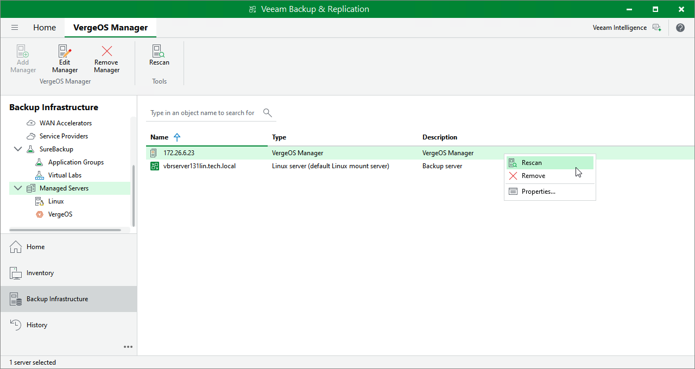

# Rescanning Universal Hypervisor Manager

Veeam Backup & Replication retrieves information about the universal hypervisor environment from the Universal Hypervisor Manager. However, the data synchronization process may take some time to complete. If you make any changes to the universal hypervisor environment and want the Veeam Backup & Replication console to display the changes immediately, you can rescan the Universal Hypervisor Manager manually.

To rescan the Universal Hypervisor Manager, do the following:

1. Open the Backup Infrastructure view.
2. In the inventory pane, click Managed Servers.
3. In the working area, select the required hypervisor manager supported by Veeam Plug-in for Universal Hypervisor API and click Rescan on the ribbon, or right-click the manager and select Rescan.

Veeam Plug-in for Universal Hypervisor API supports the VergeOS and Platform9 hypervisors.

Page updated 2026-07-24

