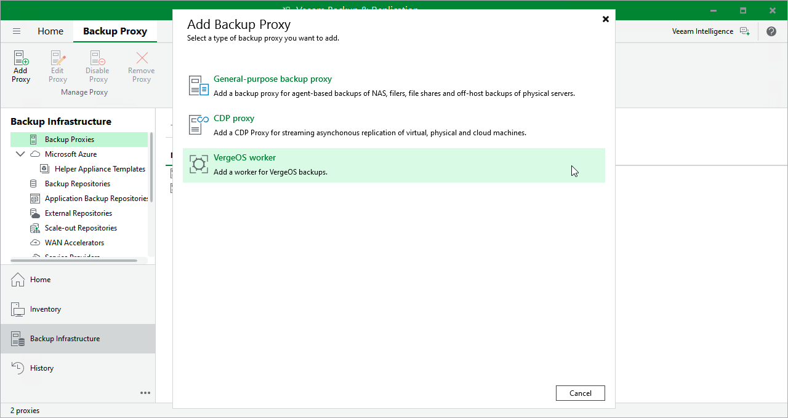

# Step 1. Launch New Worker Wizard

To launch the New Worker wizard, do the following:

1. In the Veeam Backup & Replication console, open the Backup Infrastructure view.
2. In the inventory pane, select Backup Proxies.
3. On the ribbon, select Add Proxy.

1. In the Add Backup Proxy window, select the necessary hypervisor to launch the New Worker wizard.

|  |
| --- |
| Note |
| Currently, Veeam Plug-in for Universal Hypervisor API supports the VergeOS and Platform9 universal hypervisors. |

Page updated 2026-07-10

