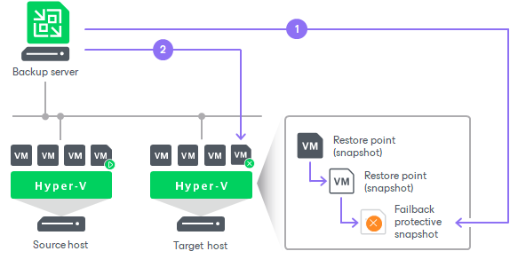

# Failback Undo

In this article

Failback undo is one of the ways to finalize failback. When you undo failback, you confirm that the VM to which you failed back (the production VM) and changes sent to it during failback work in a wrong way and you want to get back to the replica.

The failback undo operation is performed in the following way:

1. Veeam Backup & Replication powers off the production VM.
2. Veeam Backup & Replication reverts the VM replica to its pre-failback state.
3. Veeam Backup & Replication powers on the VM replica and changes the VM replica state from Failback to Failover.

Related Topics

[Undoing Failback](failback_undo_hv.md)

Page updated 1/28/2025

Page content applies to build 13.0.1.1071
