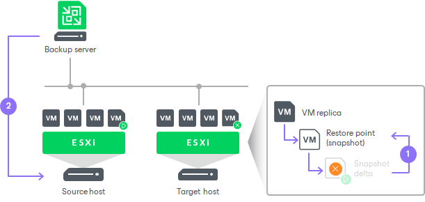

# Failover Undo

Failover undo is one of the ways to finalize failover. When you undo failover, you switch back from a VM replica to the source VM. Veeam Backup & Replication discards all changes made to the VM replica while it was in the Failover state.

The failover undo operation is performed in the following way:

1. Veeam Backup & Replication reverts the VM replica to its pre-failover state. To do this, Veeam Backup & Replication powers off the VM replica and gets it back to the state of the latest snapshot in the snapshot chain. Changes that were written to the snapshot delta filewhile the VM replica was in the Failover state are discarded.
2. The state of the VM replica gets back to Ready, and Veeam Backup & Replication resumes replication activities for the source VM on the source host.

Related Topics

[Undoing Failover](failover_undo.md)

