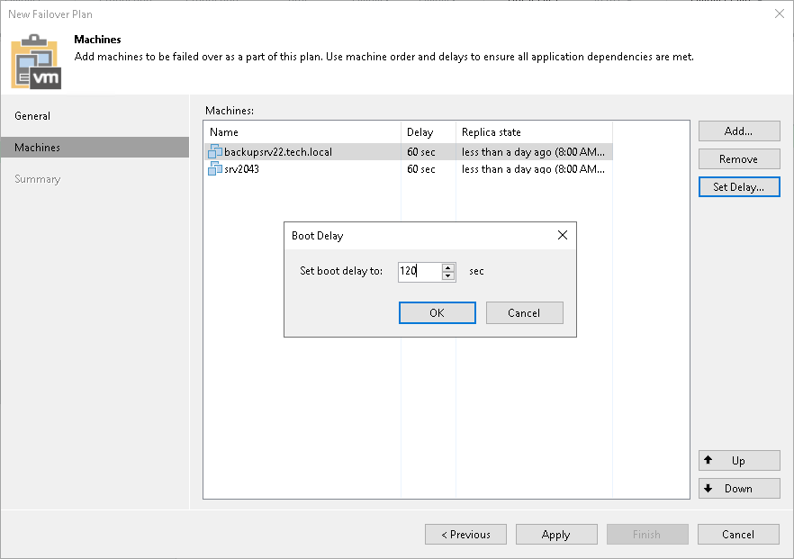

# Step 5. Set Time Delay

In this article

After you have set the order for workloads in the failover plan, you need to set a time delay for workloads. The delay time defines for how long Veeam Backup & Replication must wait before starting the failover operation for the next workload in the list. You can use time delays to make sure that some workload are already running at the moment dependent workloads start.

For example, you have added 2 workloads to the failover plan and set a time delay to 60 seconds for the first workload in the list. Veeam Backup & Replication will perform failover in the following manner: Veeam Backup & Replication will start the failover operation for the first workload in the list, then wait for 60 seconds and start the failover operation for the second workload in the list.

|  |
| --- |
| Note |
| Time delays can be specified for all workloads in the list except the last one. If you do not specify time delays, workloads will be started simultaneously. |

To set the time delay for a workload:

1. Select it and click Set Delay on the right or double-click the workload in the list.
2. Enter the time interval that you consider sufficient for this workload to boot.

Page updated 10/28/2025

Page content applies to build 13.0.1.1071
