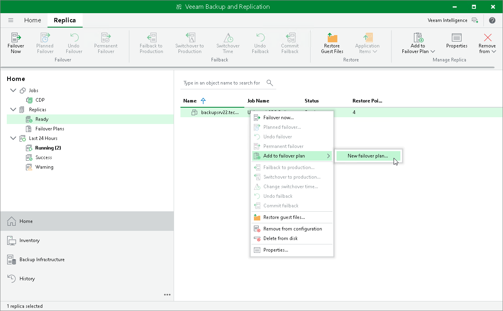

# Step 1. Launch New Failover Plan Wizard

To launch the New Failover Plan wizard, do one of the following:

1. Open the Home view.
2. In the working area, select workloads that you want to add to a failover plan.
3. On the ribbon, click Add to Failover Plan > New failover plan if you want to create a new failover plan, or Add to Failover Plan > <Plan Name> if you want to add workloads to an existing failover plan. Alternatively, you can right-click one of the selected workloads, and select Add to failover plan > New failover plan or Add to failover plan > <Plan Name>.

