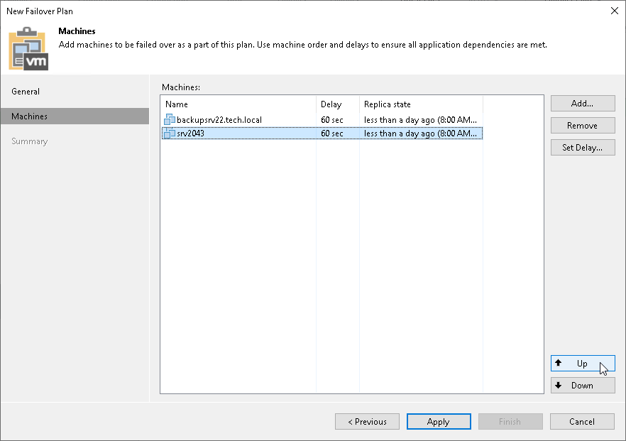

# Step 4. Define Failover Order

At the Machines step of the wizard, click Up and Down to change the processing order. Workloads at the top of the list have a higher priority and will be started first. If some workloads provide an environment for other dependent workloads, make sure that they are started first.

