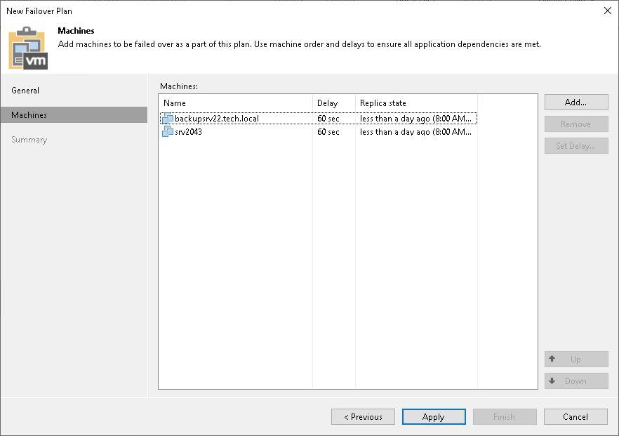

# Step 3. Select Workloads

In this article

At the Machines step of the wizard, select workloads that you want to add to the failover plan.

To add workloads:

1. Click Add.
2. Select where to browse for workloads:

* From infrastructure — browse the virtual environment and select workloads.

* From replicas — browse existing replication jobs and select workloads from replication jobs.

To quickly find the necessary workloads, you can use the search fields.

|  |
| --- |
| Note |
| A source from which you add a workload to a failover plan does not affect whether you fail over to the latest or specific restore point. It is the command that you select when starting a failover plan that defines the restore point. For more information, see [Running Failover Plans](uni_cdp_running_failover_plans.md). |

Page updated 10/28/2025

Page content applies to build 13.0.1.1071
