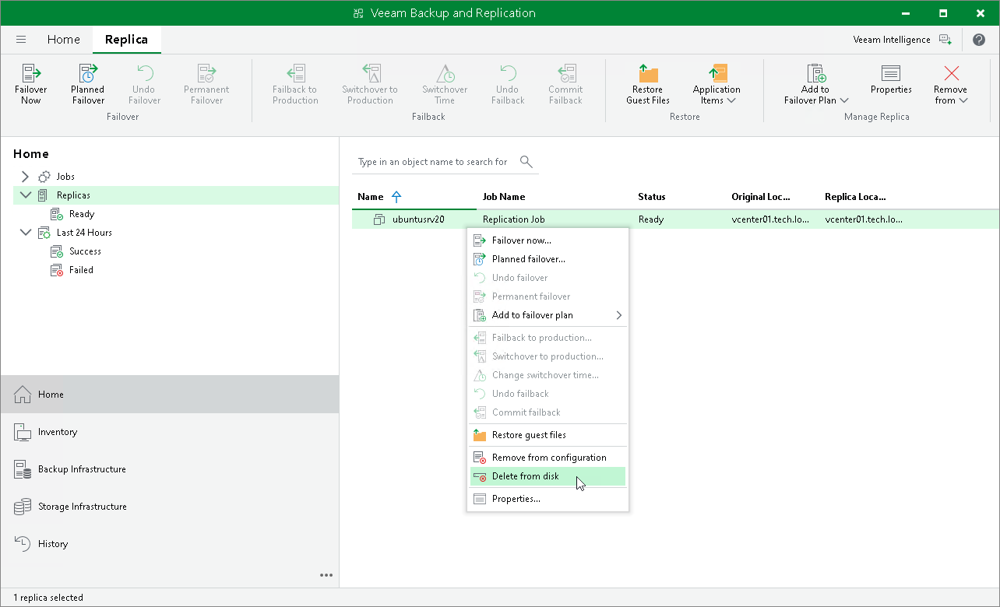

# Deleting Replicas from Disk

In this article

When you delete replicas from disks, Veeam Backup & Replication removes the replicas not only from the Veeam Backup & Replication console and configuration database, but also from host storage.

|  |
| --- |
| Note |
| Consider the following:   * You can delete records only about replicas that are in the Ready state. * Do not delete replica files from the destination storage manually, use the Delete from disk option instead. If you delete replica files manually, subsequent replication sessions will fail. * Unlike the Remove from configuration operation, the Delete from disk operation does not remove the processed workload from the initial replication job. This means that the replication process will restart for this workload. To avoid this, you can exclude the workload from the replication job or disable the job. |

To delete replica files from disks:

1. Open the Home view.
2. In the [inventory pane](vbr_ui.md), click the Replicas node.
3. In the working area, select the necessary replica and click Remove from > Disk on the ribbon. As an alternative, right-click the replica and select Delete from disk.

Page updated 9/25/2025

Page content applies to build 13.0.1.1071
