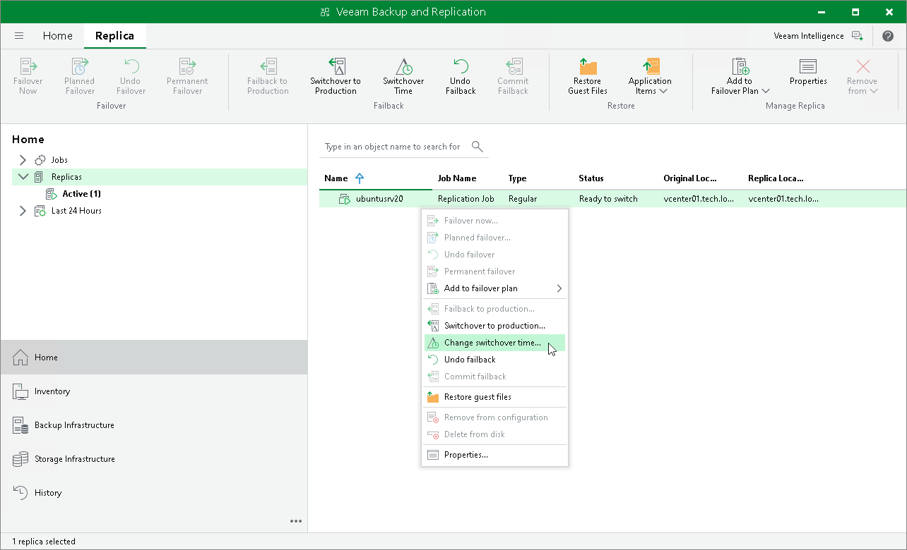

# Changing Switching Time

In this article

The following instructions apply if you have selected to switch from replicas to the production VMs manually or at the scheduled time at the Failback Mode step of the Failback wizard.

To change the time when Veeam Backup & Replication will switch to production site:

1. Open the Home view.
2. In the inventory pane, navigate to the Replicas > Active node.
3. Right-click a replica in the Ready to switch state and select Change switching time.

Page updated 10/8/2025

Page content applies to build 13.0.1.1071
