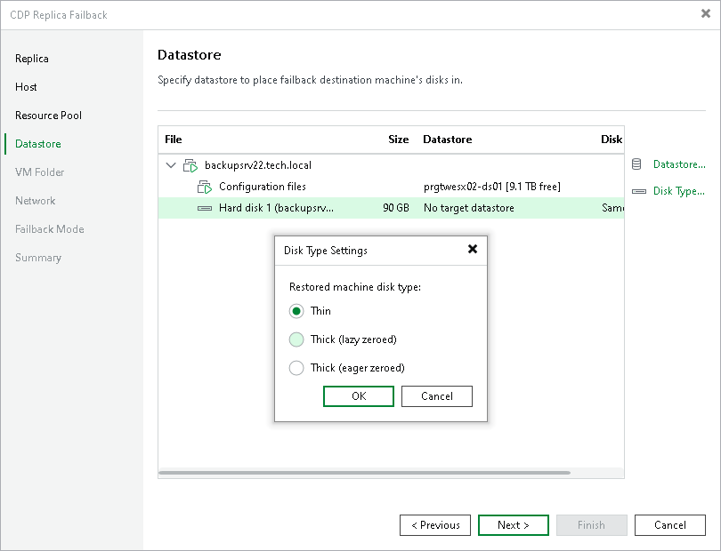

# Step 5. Select Datastores

In this article

At the Datastore step of the wizard, specify datastores where you want to store configuration files and disk files of production VMs. Also, you can change disk types.

1. To change a datastore where VM files will be stored, select the necessary VMs and click Datastore. From the list of available datastores, select the necessary datastore.

If configuration and disk files of VMs must be placed to different datastores, select files of the necessary type, click Datastore and select the datastore.

1. To change disk type settings, select the necessary disk files and click Disk Type. In the Disk Type Settings window, select the necessary disk type. For more information about disk types, see [VMware docs](https://docs.vmware.com/en/VMware-vSphere/7.0/com.vmware.vsphere.vm_admin.doc/GUID-4C0F4D73-82F2-4B81-8AA7-1DD752A8A5AC.html).

By default, Veeam Backup & Replication preserves disk types of the source workloads.

|  |
| --- |
| Note |
| You can change disk types only for VMs with Virtual Hardware version 7 or later. |

Page updated 10/28/2025

Page content applies to build 13.0.1.1071
