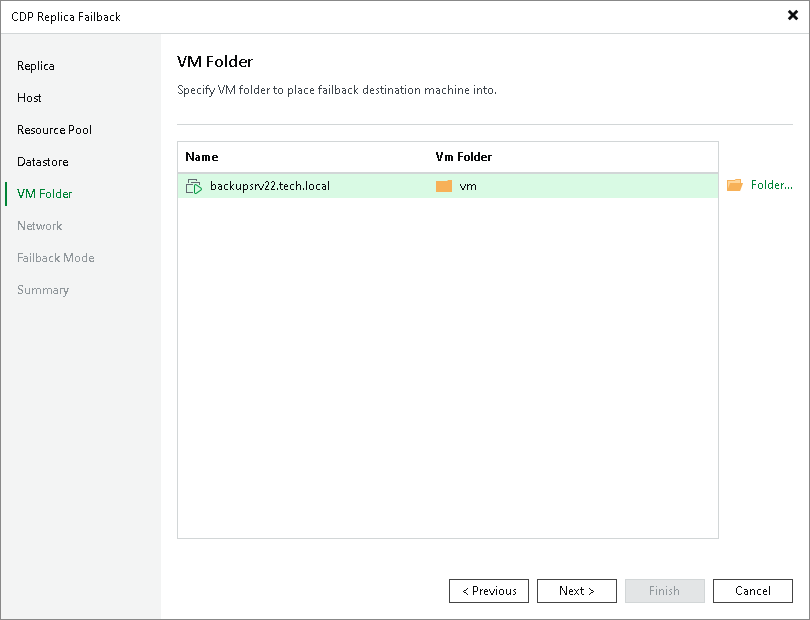

# Step 6. Select Folders

At the VM Folder step of the wizard, specify folders in the target datastores where all files of the production VMs will be stored.

|  |
| --- |
| Note |
| You can select destination folders only for destinations other than standalone hosts. |

