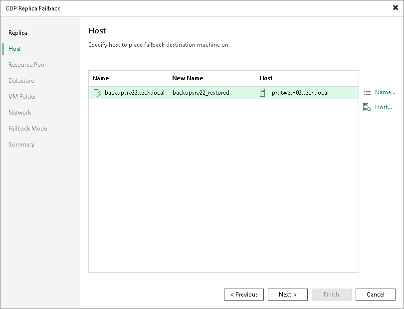

# Step 3. Select Hosts or Clusters

In this article

At the Host step of the wizard, specify names for the production VMs (VMs recovered from replicas) and destination (production site) where the VMs will be registered. You can select hosts or clusters as the destination. To specify these options, select one or multiple workloads and use Host or Name button.

Page updated 10/28/2025

Page content applies to build 13.0.1.1071
