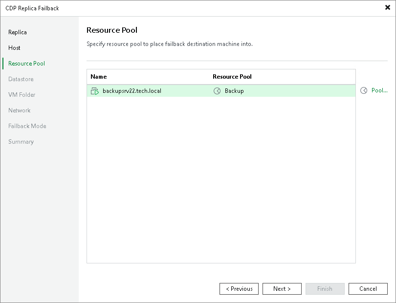

# Step 4. Select Resource Pools

At the Resource Pool step of the wizard, select resource pools to which the production VMs will be added. To do this, select VMs that you want to add to the same resource pool, click Pool and select the necessary resource pool in the Select Resource Pool window.

As an alternative, you can select a vApp to which the production VMs will be included. To find the necessary vApp, at the left bottom corner of the Select Resource Pool window, click the resource pool icon () and select VirtualApp.

