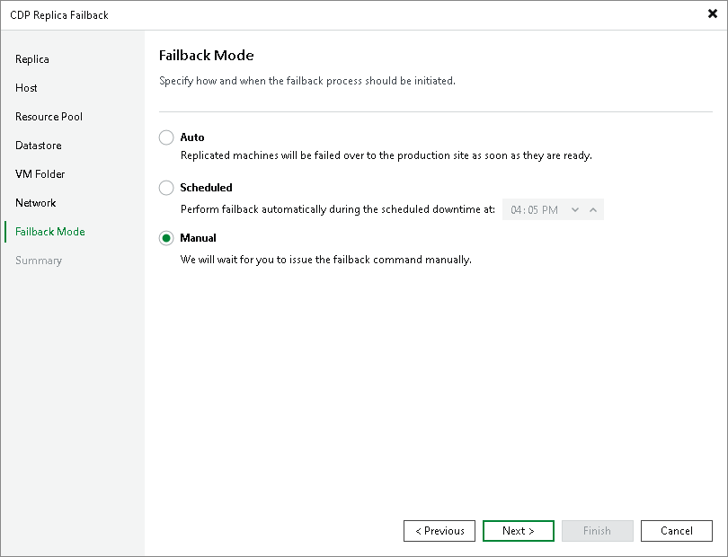

# Step 8. Schedule Switch to Production VMs

In this article

At the Failback Mode step of the wizard, specify when switch from replicas to the VMs in the production site must be performed:

* Select Auto if you want Veeam Backup & Replication to perform the switch automatically right after the state of the production VM is synchronized with the state of their replicas.
* Select Scheduled if you want Veeam Backup & Replication to perform the switch at a specific time.
* Select Manual if you want to perform the switch manually.

If you select the Scheduled or Manual option, you can further reset or set the scheduled time or switch to the production VMs manually. For more information, see [Changing Switching Time](uni_cdp_failback_change_switching_time.md) and [Switching to Production VMs Manually](uni_cdp_failback_switch_manually.md).

Page updated 10/28/2025

Page content applies to build 13.0.1.1071
