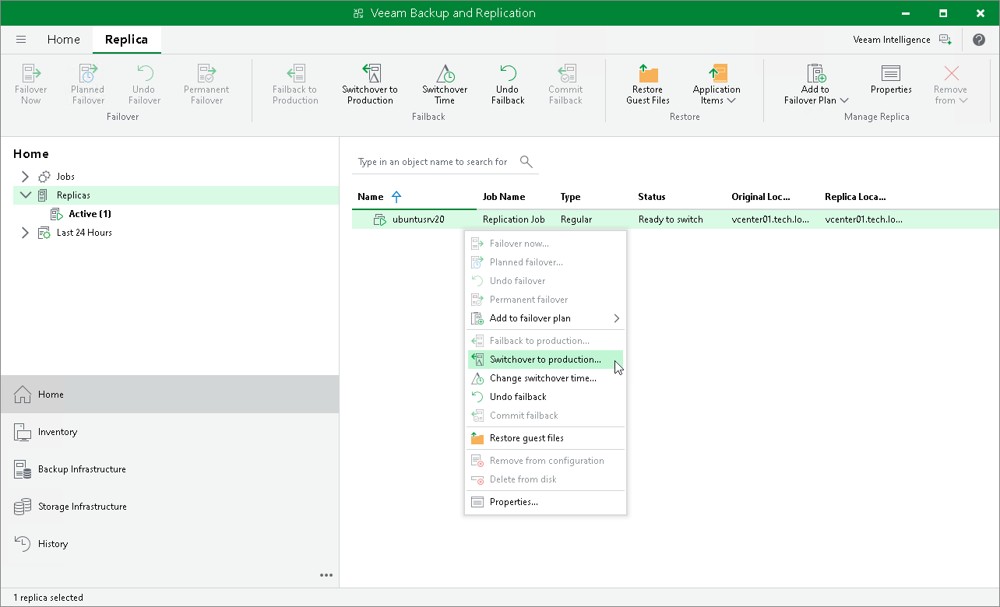

# Switching to Production VMs Manually

In this article

The following instructions apply if you have selected to switch from replicas to the VMs in the production site manually or at the scheduled time at the Failback Mode step of the Failback wizard.

To switch to the production site, do the following:

1. Open the Home view.
2. In the inventory pane, navigate to the Replicas > Active node.
3. Right-click a replica in the Ready to switch state and select Switchover to production.

What You Do Next

After you switch to the production site, you must finalize failback. You can finalize failback in the following ways:

* [Commit failback](uni_cdp_failback_commit.md)
* [Undo failback](uni_cdp_failback_undo.md)

Page updated 10/8/2025

Page content applies to build 13.0.1.1071
