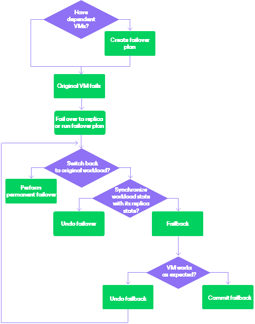

# Failover and Failback for Universal CDP

In this article

Failover and failback operations help you ensure that your business will function even if a disaster strikes your production site. Failover is a process of switching from the source workload to its replica on a host in the disaster recovery site. Failback is a process of switching from the replica to the new production VM. This production VM will be recovered from a replica.

Veeam Backup & Replication provides the following failover and failback operations:

* Perform failover

When you perform failover, you shift all processes from the source workload in the production site to the replica in the disaster recovery site. During failover, changes made on the replica are not reflected on the source workload.

Failover is an intermediate step that needs to be finalized: you can undo failover, perform permanent failover or perform failback.

For more information on how failover is performed, see [Failover](uni_cdp_failover.md).

* Create failover plan

When you create a failover plan, you define the order in which Veeam Backup & Replication must perform failover, and an interval of time for which Veeam Backup & Replication must wait before starting the failover operation for the next workload in the list.

For more information on failover plans, see [Failover Plans](uni_cdp_failover_plan.md).

* Perform permanent failover

When you perform permanent failover, you permanently switch from the source workload to a replica and use this replica as the source workload.

For more information on how permanent failover is performed, see [Permanent Failover](uni_cdp_permanent_failover.md).

* Undo failover

When you undo failover, you switch back to the source workload and discard all changes made to the replica while it was running.

You can use the undo failover scenario if you have failed over to the replica for testing and troubleshooting purposes, and you do not need to synchronize the source workload state with the current state of the replica.

For more information on how failover undo is performed, see [Failover Undo](uni_cdp_failover_undo.md).

* Perform failback

When you perform failback, you shift all processes to the production VM recovered from the replica and send to the production VM all changes that took place while the replica was running. The production VM can be recovered to a new location. During failback, changes made on the source workload are not sent to the replica.

For more information on how failback is performed, see [Failback](uni_cdp_failback.md).

When you perform failback, changes are only sent to the production VM recovered from the replica, but not published. You must test whether the production VM works with these changes. Depending on the test results, you can do the following:

* Commit failback. When you commit failback, you confirm that the production VM works as expected and you want to get back to it.

For more information on how failback commit is performed, see [Failback Commit](uni_cdp_failback_commit.md).

* Undo failback. When you undo failback, you confirm that the production VM is not working as expected and you want to get back to the replica.

For more information on how failback undo is performed, see [Failback Undo](uni_cdp_failback_undo.md).

Veeam Backup & Replication supports failover and failback operations for one workload and for several workloads. In case one or several hosts fail, you can use batch processing to restore operations with minimum downtime.

The following scheme can help you decide which steps are preferable when you fail over to a replica.

Related Topics

* [Failover](uni_cdp_failover.md)
* [Failover Plans](uni_cdp_failover_plan.md)
* [Permanent Failover](uni_cdp_permanent_failover.md)
* [Failover Undo](uni_cdp_failover_undo.md)
* [Failback](uni_cdp_failback.md)
* [Failback Commit](uni_cdp_failback_commit.md)
* [Failback Undo](uni_cdp_failback_undo.md)

Page updated 10/15/2025

Page content applies to build 13.0.1.1071
