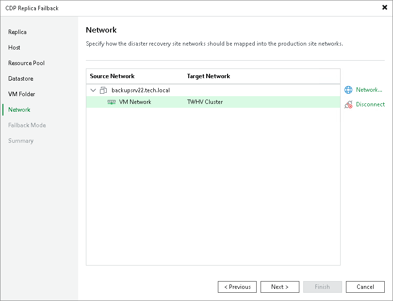

# Step 7. Configure Network Mapping

At the Network step of the wizard create a network mapping table. This table maps networks in the DR site to networks in the site where the production VMs will reside. Veeam Backup & Replication will use the network mapping table to update configuration files of VMS on the fly, during the failback process.

To change networks to which the production VMs will be connected:

1. In the Network connections list, select the necessary VMs and click Network.

If VMs are connected to multiple networks, select networks which you want to map.

1. In the list of available networks, select a network to which the production VM will be connected.

If you do not want to connect the production VMs to any virtual network, select the VMs and click Disconnect.

