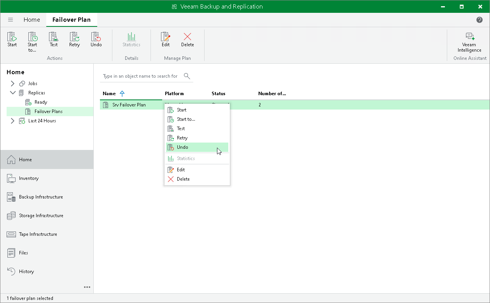

# Undoing Failover by Failover Plans

You can undo failover for all workloads added to the failover plan at once. When you undo failover, you switch the workload back to source workloads and discard all changes that were made to replicas during failover. If some of the workloads were already failed back, for example manually by the user, they are skipped from processing.

Veeam Backup & Replication starts the failover undo operation for a group of 5 workloads at the same time. The time interval between the operation starts is 10 seconds. For example, if you have added 10 workloads to the failover plan, Veeam Backup & Replication will undo failover for the first 5 workloads in the list, then will wait for 10 seconds and undo failover for the remaining 5 workloads in the list. Time intervals between the operation starts help Veeam Backup & Replication reduce the workload on the production environment and the backup server.

To undo failover by a failover plan:

1. Open the Home view.
2. Expand the Replicas node.
3. Select Failover Plans.
4. In the working area, right-click the failover plan and select Undo.
5. In the displayed dialog box, click Yes to confirm the operation.

