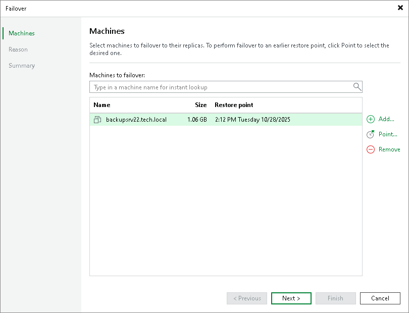

# Step 2. Select Workloads

In this article

At the Machines step of the wizard, you can modify a list of workloads from which you fail over. To add workloads, click Add > From infrastructure if you want to add workloads from the virtual infrastructure, or Add > From replicas if you want to add workloads from existing replicas. Then select the necessary workloads.

Page updated 10/28/2025

Page content applies to build 13.0.1.1071
