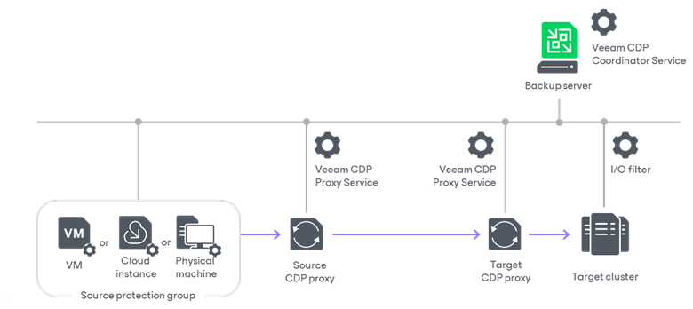

# Backup Infrastructure for Universal CDP

In this article

The following backup infrastructure components are required for universal CDP:

* [Backup server](#backup_server)
* [Source workloads](#workloads)
* [CDP proxies](#cdp_proxies)
* [Target host or cluster](#hosts)

Backup Server

The backup server is the configuration, administration and management core of the backup infrastructure. The backup server runs the Veeam CDP Coordinator Service. This service coordinates replication and data transfer tasks, and controls resource allocation. We recommend you to place the backup server in the target site or as a separate unit.

For more information on the backup server, see [Backup Server](backup_server.md).

Source Workloads

Source workloads can be of various types, such as physical machines, virtual machines, or cloud instances. However, Veeam Backup & Replication supports specific operation systems. For more information, see [Supported Platforms, Applications and Workloads](platform_support.md#uni).

Veeam CDP Agent Service and Veeam CDP Volume Filter Driver

To protect workloads, you must install the Veeam CDP Agent Service and Veeam CDP Volume Filter Driver on those workloads.

The driver intercepts I/O transactions generated by the operating system and sends them to the CDP agent service. The CDP agent service deploys the drivers, receives the captured data, aggregates it and sends to the CDP proxies. For information on how to install the service and the drivers, see [Installing CDP Agent Service and Filter Driver](uni_cdp_service_install.md).

CDP Proxies

A CDP proxy is a component that operates as a data mover and transfers data between the source and target hosts. We recommend you to configure at least two CDP proxies: one (source proxy) in the production site and one (target proxy) in the disaster recovery site.

The source and target CDP proxies perform the following tasks:

* The source proxy prepares data for short-term restore points from data received from the source host, compresses and encrypts the data (if encryption is enabled in the [network traffic rules](internet_rule.md)). Then sends it to the target proxy.
* The target proxy receives the data, decompresses and decrypts it, and then sends to the target host.

For more information on CDP proxies, their requirements, limitations and deployment, see [CDP Proxies](cdp_proxy.md).

Target Host or Cluster

You can choose a host or cluster as a target for universal CDP replication. The target host or cluster is the terminal point to which replicated data is moved. The target receives data from target proxies and saves this data to replicas on the datastore. Also, the target manages replicas: creates replicas, retains restore points and so on.

The host or cluster must have the I/O filter installed. To be able to install the filter, the target host must be a part of a cluster managed by the same vCenter Server. For more information on requirements to the host and clusters and how to add vCenter Servers to the backup infrastructure, see the [Considerations and Limitations](uni_cdp_considerations.md) and [Adding VMware vSphere Servers](add_vmware_server.md) sections.

I/O Filter

The I/O filter processes I/O receives data from CDP proxies. The filter also communicates with the Veeam CDP Coordinator Service on the backup server and notifies the service that the backup infrastructure must be reconfigured if any proxy becomes unavailable. This I/O filter is built on the basis of vSphere API for I/O filtering (VAIO).

For more information on how to install the filter, see [Installing I/O Filter](cdp_io_filter_install.md).

Page updated 11/19/2025

Page content applies to build 13.0.1.1071
