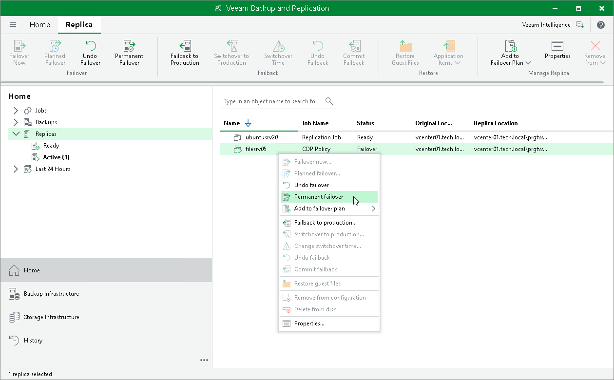

# Performing Permanent Failover

For more information on permanent failover, see [Failover and Failback for Universal CDP](uni_cdp_failover_failback.md) and [Permanent Failover](uni_cdp_permanent_failover.md).

To perform permanent failover, do the following:

1. Open the Home view.
2. In the [inventory pane](vbr_ui.md) navigate to the Replicas > Active node.
3. In the working area, select the necessary replica and click Permanent Failover on the ribbon. Alternatively, right-click the necessary replica and select Permanent failover.

