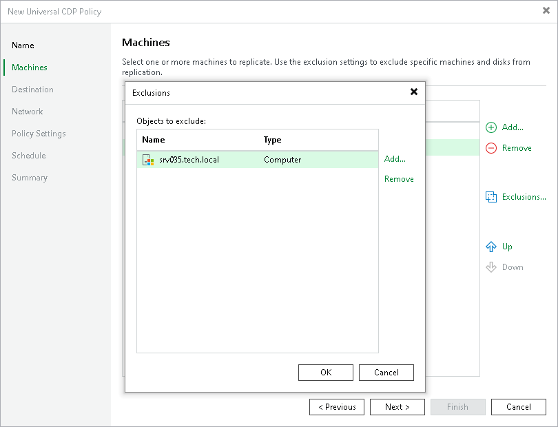

# Step 4. Exclude Objects

In this article

After you have added workloads or protection groups to the CDP policy, you can specify which workloads you want to exclude from being replicated.

To exclude workloads:

1. At the Machines step of the wizard, click Exclusions.
2. In the Exclusions window, click Add.
3. In the Select Objects window, select workloads that you want to exclude from being replicated and click Add.
4. Click OK.

Page updated 10/24/2025

Page content applies to build 13.0.1.1071
