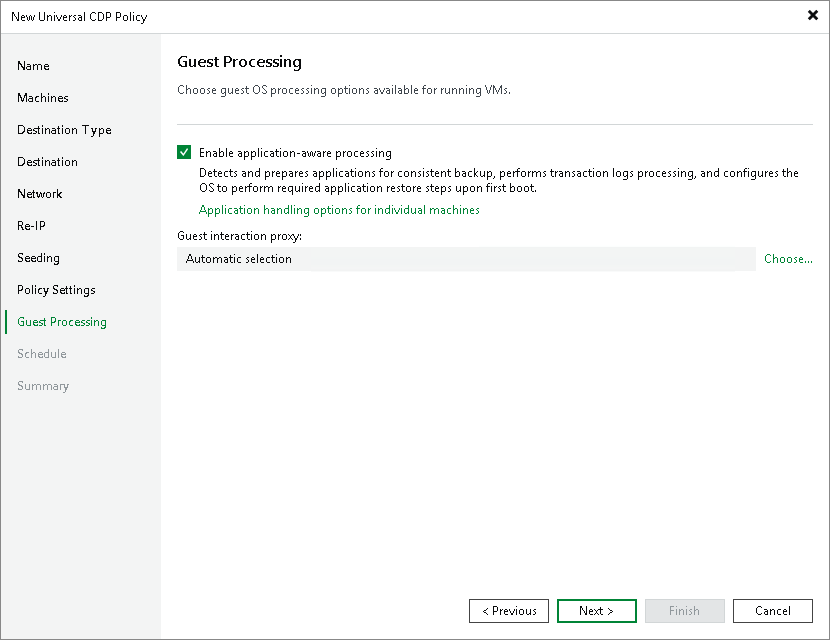

# Step 12. Specify Guest Processing Settings

Settings configured at this step apply only to long-term restore points.

At the Guest Processing step of the wizard, enable and configure guest OS processing.

Guest OS processing involves application-aware processing that allows creation of transactionally consistent replicas. In its turn, application-aware processing includes log truncation, execution of custom scripts and guest OS file exclusions. For more information on guest processing, see the [Guest Processing](guest_processing.md) section.

To be able to use guest processing, Veeam Backup & Replication needs to access guest OSes and uses for this credentials from the [protection group from which you added the workloads](uni_cdp_service_install.md).

To enable guest OS processing and start configuring it:

1. Select Enable application-aware processing.

When you select this option, Veeam Backup & Replication enables application-aware processing with the default settings for all workloads. You can further disable application-aware processing for individual workloads and reconfigure the default settings.

1. If you have added Microsoft Windows workloads to be processed, specify which guest interaction proxy Veeam Backup & Replication can use to perform different guest processing tasks:

* If you want Veeam Backup & Replication to select the guest interaction proxy automatically, leave Automatic selection on the Guest interaction proxy field.
* If you want to explicitly specify which servers will perform the guest interaction proxy role, click Choose. In the Guest Interaction Proxy window, click Prefer the following guest interaction proxy server, and select the necessary proxies.

For more information on the guest interaction proxy, requirements and limitations for it, see [Guest Interaction Proxies](guest_interaction_proxy.md).

After you have enabled application-aware processing for all workloads and configured other settings required for guest processing, you can disable application-aware processing for individual workloads and change the default settings. For more information, see the following sections:

* [Application-aware processing and transaction logs](cdp_policy_guest_general.md)
* [Microsoft SQL Server transaction log settings](cdp_policy_sql_trans_logs.md)
* [Oracle archived log settings](cdp_policy_oracle_trans_logs.md)
* [PostgreSQL settings](cdp_policy_postgre.md)
* [Pre-freeze and post-thaw scripts](cdp_policy_guest_scripts.md)

Page updated 2026-05-07

