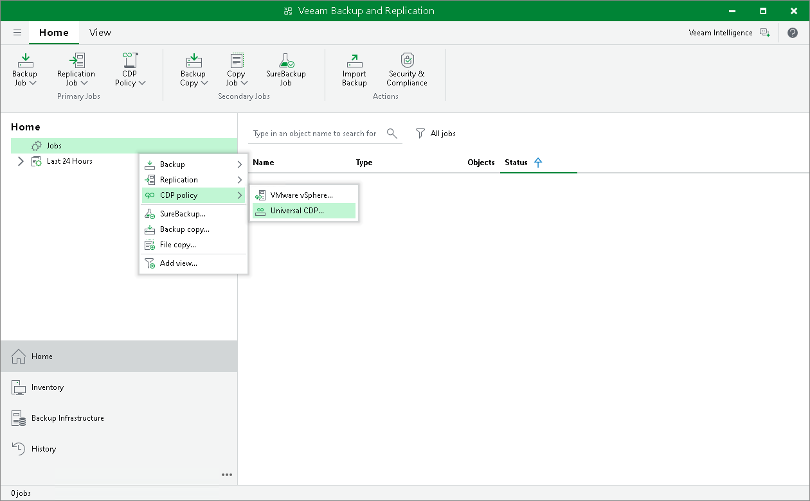

# Step 1. Launch New Universal CDP Policy Wizard

To launch the New Universal CDP Policy wizard, do one of the following:

* Open the Home view. On the ribbon, click CDP Policy > Universal CDP.
* Open the Home view. In the inventory pane, right-click Jobs and select CDP policy > Universal CDP.

