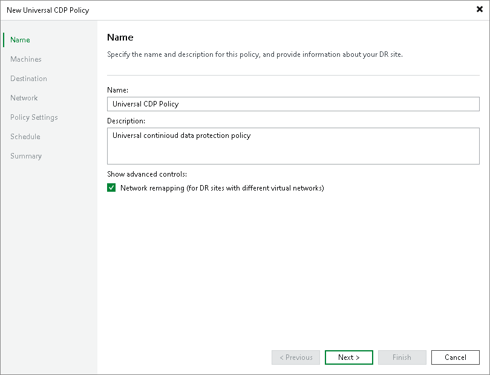

# Step 2. Specify Policy Name and Advanced Settings

At the Name step of the wizard, specify a name and description for the CDP policy, and choose whether you want to use replica seeding or network mapping:

1. In the Name field, enter a name for the CDP policy.
2. In the Description field, provide a description for future reference.
3. If your DR site networks do not match your production site networks, select the Network remapping (for DR sites with different virtual networks) check box.

When selected, this check box enables the Network step where you will have to configure a network mapping table.

