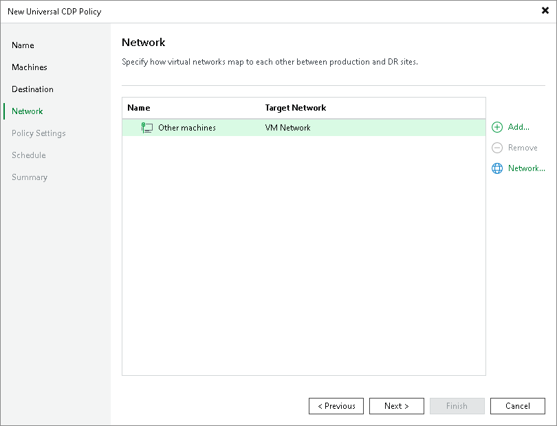

# Step 6. Configure Network Mapping

The Network step of the wizard is available if you have selected the Network remapping option at the [Name](uni_cdp_policy_name.md) step.

At the Network step of the wizard, configure a network mapping table. This table maps networks in the production site to networks in the disaster recovery (DR) site. When the replication session starts, Veeam Backup & Replication will check the network mapping table. Then Veeam Backup & Replication will update replica configuration to replace the production networks with the specified networks in the DR site. As a result, you will not have to re-configure network settings manually.

You can configure network mapping for all workloads in the policy or for individual workloads.

To specify a network for all workloads in the policy, select Other machines, click Network, and select the network in the DR site. Replicas will connect to this network.

To specify a network for an individual workload:

1. Click Add.
2. In the Select Host window, select a workload and click OK.
3. Select the workload in the list and click Network. Alternatively, you can open the workload and specify a network for each network adapter.
4. In the Select Network window, select the network in the DR site to which the replica will be connected and click OK.

