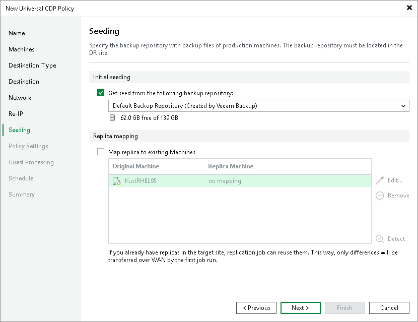

# Step 9. Configure Seeding and Mapping

The Seeding step is available if you have selected the Replica seeding check box at the [Name](uni_cdp_policy_name.md) step of the wizard.

At the Seeding step of the wizard, configure replica seeding. Seeding helps reduce the amount of traffic sent during the initial replica synchronization. For more information on when to use seeding and mapping, see [Replica Seeding and Mapping](uni_cdp_seeding.md).

To configure replica seeding:

1. Make sure that you have backups of replicated workloads in a backup repository in the DR site. If you do not have the backups, create them as described in section [Creating Replica Seeds for CDP](uni_creating_replica_seed.md).

|  |
| --- |
| Important |
| Consider the following:   * Backups for seeding must be created by [Veeam Agent for Linux or Veeam Agent for Microsoft Windows](agents_introduction.md).  * Backups for seeding must not reside in a scale-out backup repository. |

1. Select the Get seed from the following backup repository check box.
2. From the list of available backup repositories, select the repository where your replica seeds are stored.

|  |
| --- |
| Note |
| If a VM has a seed and is mapped to an existing replica, replication will be performed using replica mapping because mapping has a higher priority. |

Configuring Replica Mapping

To configure replica mapping:

1. Select the Map replicas to existing VMs check box.
2. If you want Veeam Backup & Replication to scan the DR site to detect existing copies of workloads that you plan to replicate, click Detect.

If any matches are found, Veeam Backup & Replication will populate the mapping table. If Veeam Backup & Replication does not find a match, you can map a workload to its copy manually.

1. If you want to map a workload manually, select a source workload from the list, click Edit and select the copy of this workload on the target host in the DR site.

To remove a mapping association, select a workload in the list and click Remove.

Page updated 2026-05-20

