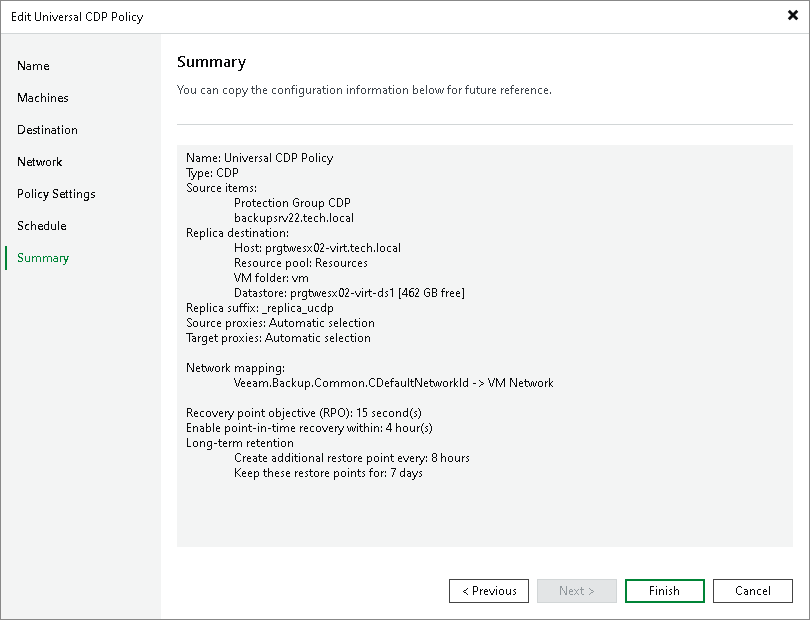

# Step 10. Finish Working with Wizard

At the Summary step of the wizard, review the configured settings. Then click Finish to close the wizard.

Related Topics

[Failover and Failback for CDP](uni_cdp_failover_failback.md)

