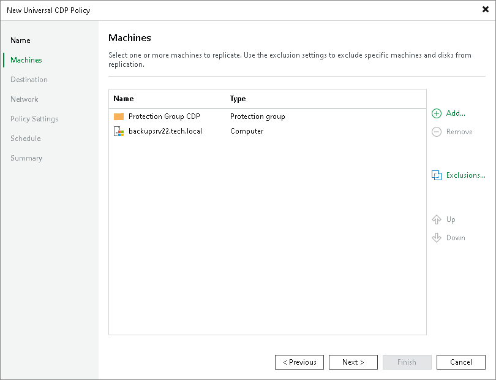
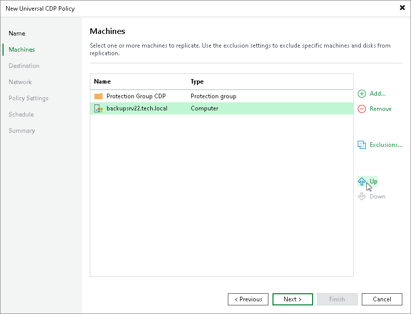

# Step 3. Select Workloads to Replicate and Processing Order

At the Machines step of the wizard, add workloads that you want to replicate and configure their processing order.

Selecting Workloads to Replicate

Select workloads or protection groups that you want to replicate:

1. Click Add.
2. In the Select Objects window, select the necessary workloads or protection groups and click OK.

|  |
| --- |
| Important |
| Consider the following:   * You can replicate only workloads that are turned on, the turned off workloads will be skipped from processing. * You cannot add to a universal CDP policy workloads that were already added to other universal CDP policies created on the same backup server. |

To quickly find the necessary workloads, you can use the search field at the bottom of the Select Objects window. If you want to switch between types of workloads you want to search through, use the button to the left of the search field.

Specifying Processing Order

At the Machines step of the wizard, click Up and Down to change the processing order. Workloads at the top of the list have a higher priority and will be processed first.

|  |
| --- |
| Note |
| Consider the following:   * Workloads inside a protection group are processed at random. To ensure that workloads are processed in the defined order, you must add them as individual workloads, not as a part of protection groups. * The processing order may differ from the order that you have defined. For example, if resources of a workload that is higher in the priority are not available, and resources of a workload that is lower in the priority are available, Veeam Backup & Replication will process the workload with the lower priority first. |

