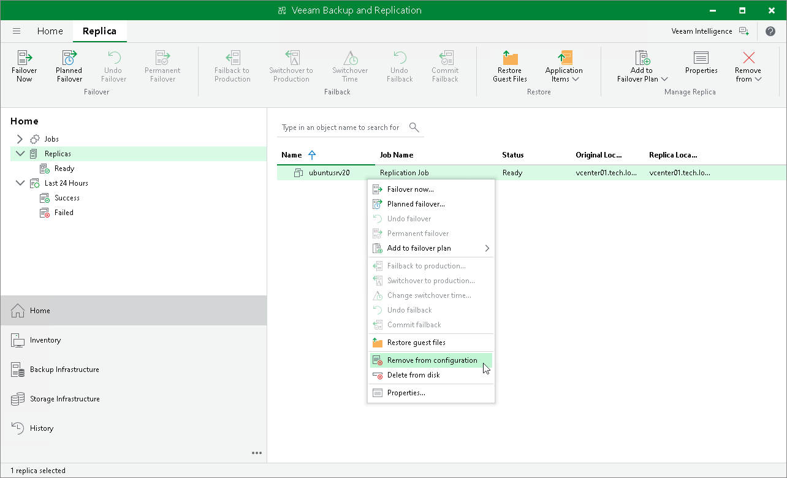

# Removing Replicas from Configuration

In this article

When you remove replicas from the configuration, Veeam Backup & Replication removes records about the replicas from the configuration database, stops showing the replicas in Veeam Backup & Replication console and also stops synchronizing their state with the state of the source VMs. However, the actual replicas remain on hosts.

To remove records about replicas from the Veeam Backup & Replication console and configuration database:

1. Open the Home view.
2. In the [inventory pane](vbr_ui.md), click the Replicas node.
3. In the working area, select replicas in the Ready state and click Remove from > Configuration on the ribbon. Alternatively, right-click one of the selected replicas and select Remove from configuration.

|  |
| --- |
| Note |
| Consider the following:   * You can remove records only about replicas in the Ready state. * When you remove from the configuration a workload that is replicated as a standalone object, Veeam Backup & Replication removes this workload from the initial replication job. When you remove from the configuration a workload that is replicated as part of a protection group Veeam Backup & Replication adds this workload to the [list of exclusions](cdp_policy_exclude.md) in the CDP policy. |

Page updated 9/25/2025

Page content applies to build 13.0.1.1071
