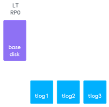
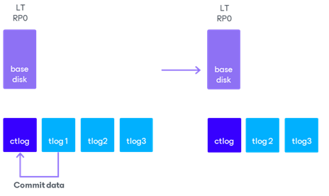
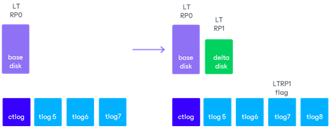
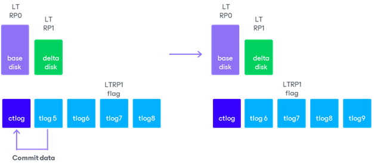
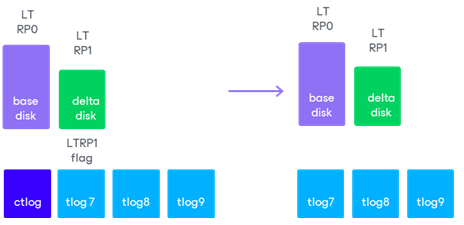
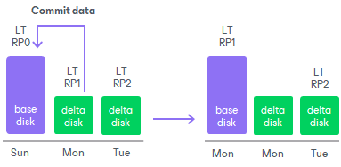
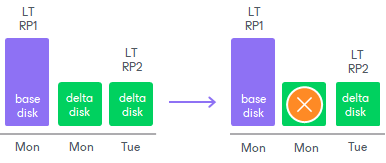

# Retention Policies

A retention policy defines for how long Veeam Backup & Replication must store restore points for replicas. Veeam Backup & Replication offers two retention policy schemes:

* [Short-term retention](#short)
* [Long-term retention](#long)

Short-term Retention

Veeam Backup & Replication retains short-term restore points for the number of hours or minutes specified in CDP policy settings. When the retention period is exceeded, Veeam Backup & Replication transforms the replication chain as described in the algorithm.

The example shows how short-term retention works for a replica with one virtual disk. Only the first base long-term retention point was created.

1. Veeam Backup & Replication checks whether the replication chain contains outdated transaction log files. A transaction log file is considered outdated when the retention period ends for all short-term restore points stored in this file.

1. If an outdated transaction log file exists, Veeam Backup & Replication creates a compacted transaction log file, commits data of the outdated transaction log into the compacted transaction log and schedules the removal of the outdated file.

1. Veeam Backup & Replication continues to create new transaction log files, to check outdated transaction log files and to commit them into the compacted transaction log file. When the long-term point creation is scheduled, Veeam Backup & Replication marks the current transaction log with a flag and creates a new transaction log file.

As the background process that takes some time, Veeam Backup & Replication does the following:

* Creates a delta disk.
* Commits data from the compacted transaction log file, transaction log file with the flag and data from the preceding transaction log files into the delta disk.

1. Veeam Backup & Replication continues to create new transaction log files, to check outdated transaction log files and commit them into the compacted transaction log file.

1. By the moment, when the transaction log file with flag becomes outdated, the data in the compacted transaction log file and the transaction log file with flag duplicate data in the delta disk. Veeam Backup & Replication deletes the redundant files.

1. Veeam Backup & Replication continues create new files and check the outdated ones as described in the algorithm, steps 1-5.

|  |
| --- |
| Note |
| Due to the chain transformations, Veeam Backup & Replication can actually store short-term restore points for a longer period than specified in the short-term retention policy. This period can be up to 25% longer than the specified short-term retention. Therefore, ensure there is sufficient free space on the target host. |

For more information on technical points, short-term restore points, long-term restore points and when they are created, see [CDP Replication Chain](uni_cdp_replica_chain.md).

Long-term Retention

Veeam Backup & Replication retains long-term restore points for the number of days specified in CDP policy settings. When the retention period is exceeded, Veeam Backup & Replication transforms the replication chain in the following way. The example shows how long-term retention works for a replica with one virtual disk.

1. Veeam Backup & Replication checks whether the replication chain contains outdated long-term restore points.
2. If an outdated restore point exists, Veeam Backup & Replication rebuilds the file of an outdated long-term restore point (LT RP) to include data of a newer long-term restore point. To do that, Veeam Backup & Replication commits into the base disk file data from the earliest delta disk file that relates to a long-term restore point. This way, the base disk file ‘moves’ forward in the replication chain.

1. Veeam Backup & Replication removes the earliest delta disk file from the chain as redundant — this data has already been committed into the base disk file.

For more information on technical points, short-term restore points, long-term restore points and when they are created, see [CDP Replication Chain](uni_cdp_replica_chain.md).

