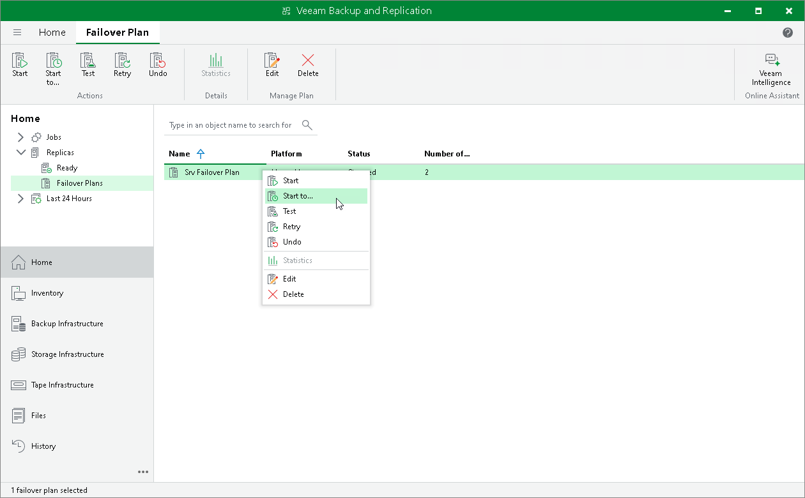

# Running Failover Plans

You have the following options to run a failover plan:

* You can fail over to latest restore points of replicas.

In this case, Veeam Backup & Replication searches for the latest restore point of replicas across all replication jobs configured on the backup server. For example, you have 2 jobs that replicate the same VM: Job 1 has created the most recent point at 2:00 AM and Job 2 has created the most recent restore point at 3:00 AM. When you run the failover plan using the Start command, Veeam Backup & Replication will pick the restore point created at 3:00 AM with Job 2.

* You can fail over to specific restore points of replicas.

Failing Over to Latest Restore Points

To fail over to the latest restore points of replicas:

1. Open the Home view.
2. Expand the Replicas node.
3. Select Failover Plans.
4. In the working area, right-click the failover plan and select Start.

Failing Over to Specific Restore Points

To fail over to specific restore points of replicas:

1. Open the Home view.
2. Expand the Replicas node.
3. Select Failover Plans.
4. In the working area, right-click the failover plan and select Start to.
5. In the displayed window, select the backup date and time. Veeam Backup & Replication will find the closest restore point prior to the entered value for each workload and will fail over to it.

