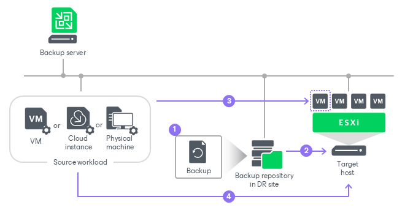
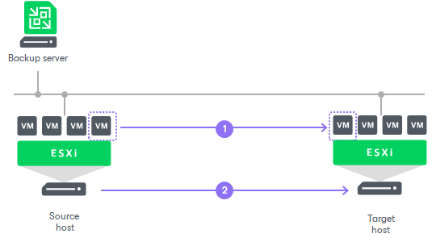

# Replica Seeding

Replica seeding and mapping are technologies that help reduce the amount of traffic sent over a network. With these technologies, Veeam Backup & Replication does not have to transfer all of workload data from the source host to the target host across the sites during the initial synchronization. For more information on the initial synchronization, see [How CDP Works](cdp_hiw.md#data).

You can use seeding and mapping in the following scenarios:

* Seeding

Configure replica seeding if, in a backup repository located in the disaster recovery (DR) site, you have backups of workloads that you plan to replicate. During replication, Veeam Backup & Replication will restore workloads from these backups and will synchronize the state of the restored workloads with the latest state of the source workloads. Then Veeam Backup & Replication will use these restored workloads as replicas.

For more information on how to create backups that can be used as "seeds" for replica, see [Creating Replica Seeds for CDP](creating_replica_seed.md).

* Mapping

Configure replica mapping if, on the host in the DR site, you have ready-to-use copies of the source workloads. These can be regular or restored workloads, or replicas created by other CDP policies. Veeam Backup & Replication will synchronize the state of these ready-to-use workloads with the latest state of the source workloads and will use these workloads as replicas.

You can also configure both replica seeding and replica mapping in the same CDP policy. For example, if a policy includes 2 workloads, you can use seeding for one workload and map the other workload to an existing VM.

Algorithm for Seeding

Replica seeding includes the following steps:

1. As a preparatory step for replica seeding, you need to create a backup of a workload that you plan to replicate. For more information on how to create a backup that will be used as a "seed" for replica, see [Creating Replica Seeds for CDP](creating_replica_seed.md).
2. When you create a CDP policy, you should point it to a backup repository in the DR site. During the initial synchronization, Veeam Backup & Replication accesses the backup repository where the replica seed is located, and restores the workload from the backup. The restored workload is registered on the target host in the DR site. Files of the restored workload are placed to the location you specify as the replica destination datastore.

Virtual disks of a replica restored from the backup preserve their format (that is, if the source workload used thin provisioned disks, virtual disks of the replica are restored as thin provisioned).

1. Veeam Backup & Replication synchronizes the restored workload with the latest state of the source workload.

After successful synchronization, in the Home view in the Veeam Backup & Replication console, under Replicas node you will see a replica with two restore points. One point will contain the state of the workload from the backup file; the other point will contain the latest state of the source workload you want to replicate.

1. During incremental synchronization, Veeam Backup & Replication transfers only incremental changes in a regular manner.

Replica seeding dramatically reduces traffic sent over WAN or slow connections because Veeam Backup & Replication does not send the full contents of the workload image. Instead, it transmits only differential data blocks.

Algorithm for Mapping

Replication to a mapped workload is performed in the following way:

1. The first step differs depending on which workload you have selected for mapping:

* If you have selected a regular or restored workload, Veeam Backup & Replication calculates the differences between the source and mapped workload.
* If you have selected a CDP replica, Veeam Backup & Replication imports all restore points of this replica and then calculates the differences between the source and mapped workload. Note that if disk sizes of the source and mapped workload differ, Veeam Backup & Replication will delete all restore points of the mapped workload.

1. To synchronize the state of the mapped workload with the state of the source workload, Veeam Backup & Replication sends the calculated changes to the mapped workload.

The first and second steps take place during the initial synchronization.

1. During the incremental synchronization, Veeam Backup & Replication transfers only incremental changes in a regular manner.

After the successful initial synchronization, in the Home view of Veeam Backup & Replication, under Replicas node you will see a replica with restore points. If you have selected for mapping a regular workload or snapshot replica, you will see two restore points: one restore point will contain the latest state of the mapped workload, the other will contain the state of the source workload. If you have selected a CDP replica, you will see all restore points of the mapped workload plus one restore point that will contain the state of the source workload.

Related Topics

[Configure Seeding](uni_cdp_policy_seeding.md)

Page updated 2026-05-20

