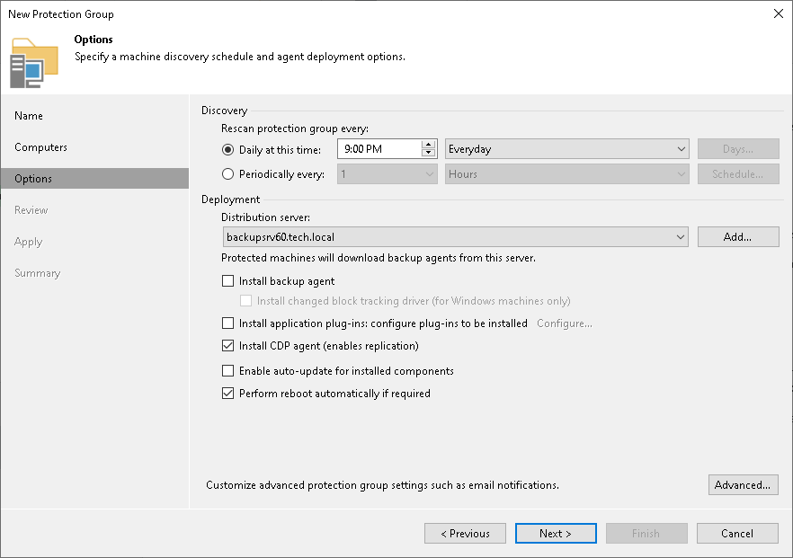

# Installing CDP Agent Service and Filter Driver

To install the Veeam CDP Agent Service and Veeam CDP Volume Filter Driver on workloads, you must create a protection group and configure it to install the service and driver:

1. Open the Inventory view.
2. In the inventory pane, right-click the Physical Infrastructure node and select Add protection group.
3. In the Add Protection Group window, select one of the following:

* Individual computers to define a static protection scope by adding specific computers to the protection group.
* Microsoft Active Directory objects to add to the protection group one or several Active Directory objects: entire domain, container, organizational unit, group or computer.
* Computers from CSV file to add to the protection group computers listed in a CSV or TXT file that resides on the backup server.

1. At the Name step, specify a name and description for the protection group.
2. At the Computers step, click Add.
3. In the Add Computer window, do the following:

1. Enter a full DNS name, NetBIOS name or IP address of the workload that you want to add to the protection group.
2. Select Connect using admin credentials and specify credentials of a user that has administrative permissions on the workload.

1. At the Options step, do the following:

1. Select Install CDP agent to install the Veeam CDP Agent Service and Veeam CDP Volume Filter Driver.
2. Select Perform reboot automatically to allow Veeam Backup & Replication to reboot the workload automatically.

|  |
| --- |
| Note |
| The universal CDP will not work until you reboot the workload after the CDP agent service and driver installation. |

1. Click Finish.

For the full description of the protection group options, see [Creating Protection Group for Individual Computers](protection_group_individual.md), [Creating Protection Group for Microsoft Active Directory Objects](protection_group_ad_objects.md) or [Creating Protection Group for Computers from CSV File](protection_group_csv_file.md).

