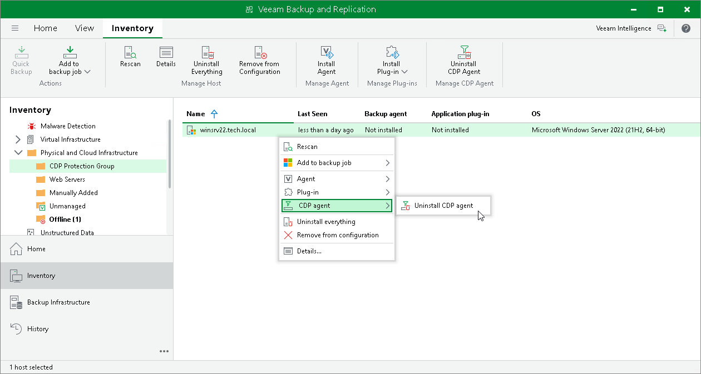

# Uninstalling CDP Agent Service and Filter Driver

You can uninstall the Veeam CDP Agent Service and Veeam CDP Volume Filter Driver from a workload added to a protection group.

|  |
| --- |
| Note |
| If you want to uninstall all Veeam components from workloads in the protection group, see [Uninstalling Veeam Agent and Other Veeam Components](agents_protected_computers_remove.md). |

To uninstall the Veeam CDP Agent Service and Veeam CDP Volume Filter Driver from a workload:

1. Open the Inventory view.
2. In the inventory pane, expand the Physical Infrastructure node and select the protection group that contains the workload.
3. In the working area, select the workload and click Uninstall CDP Agent on the ribbon or right-click the workload and select CDP agent > Uninstall CDP agent.
4. In the confirmation window, click Yes.

