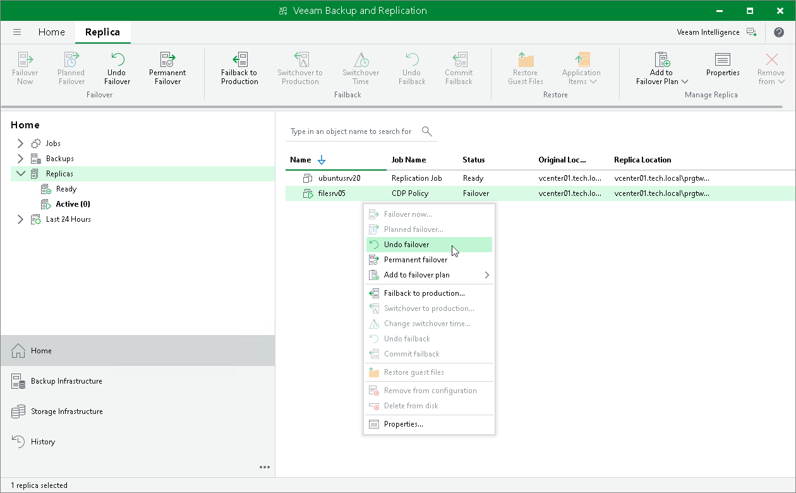

# Undoing Failover

In this article

For more information on failover undo, see [Failover and Failback for CDP](uni_cdp_failover_failback.md) and [Failover Undo](uni_cdp_failover_undo.md).

To undo failover:

1. Open the Home view.
2. In the [inventory pane](vbr_ui.md), select Replicas.
3. In the working area, select the necessary replica and click Undo Failover on the ribbon. Alternatively, right-click the necessary replica and select Undo Failover.
4. In the displayed window, click Yes to confirm the operation.

Page updated 9/25/2025

Page content applies to build 13.0.1.1071
