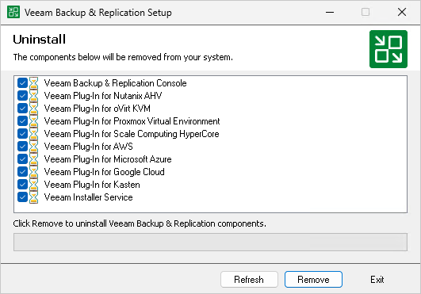

# Uninstalling Veeam Backup & Replication Console on Microsoft Windows

To uninstall the Veeam Backup & Replication console:

1. From the Start menu, select Control Panel > Programs > Programs and Features.
2. In the programs list, right-click Veeam Backup & Replication and select Uninstall. Wait for the process to complete.
3. If the program list contains additional Veeam Backup & Replication components, right-click the remaining components and select Uninstall.

