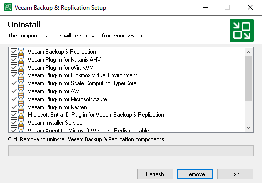

# Uninstalling Veeam Backup & Replication on Microsoft Windows

To uninstall Veeam Backup & Replication:

1. From the Start menu, select Control Panel > Programs and Features.
2. In the programs list, right-click Veeam Backup & Replication and select Uninstall. If you have Veeam Backup Enterprise Manager installed on this machine, Veeam Backup & Replication will uninstall both components. Wait for the process to complete.
3. If the program list contains additional Veeam Backup & Replication components, right-click the remaining components and select Uninstall.

The Veeam Backup & Replication configuration database is not removed during the uninstall process. All configuration data stored in the database remains as well.

