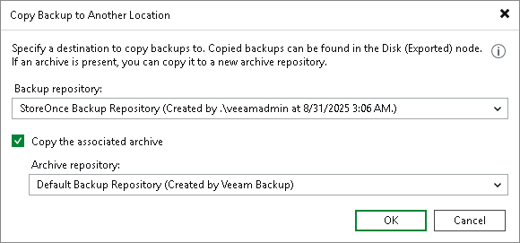

# Copying Unstructured Data Backups

Copying backups can be helpful if you want to copy file share backups to a repository or local or shared folder. Veeam Backup & Replication copies the whole backup chain.

When Veeam Backup & Replication performs the copy operation, it disables the job, copies files to the target location and then enables the job. After the copy operation finishes, the copied backups are shown in a node with the (Exported) postfix in the inventory pane.

|  |
| --- |
| Note |
| This section is about one-time copy operation. If you want to copy backups on a schedule, configure a secondary repository as described in the [Creating File Backup Jobs](file_share_backup_job_secondary_target.md) and [Creating Object Storage Backup Jobs](os_backup_job_secondary_repository.md) sections. |

Copying Backups

To copy file share backups, do the following:

1. Open the Home view.
2. In the inventory pane, select the Backups node.
3. In the working area, select the necessary job.
4. Right-click the job and select Copy backup. Alternatively, click Copy Backup on the ribbon.
5. In the Copy Backup to Another Location window, choose a repository to which you want to copy backups.
6. [For archive backups] If you also want to copy archive backups to another archive repository, select the Copy the associated archive check box. From the drop-down list, select the necessary repository.
7. Click OK.

After the copy process finishes, the copied backups are shown in the Disk (Exported) node in the inventory pane.

|  |
| --- |
| Note |
| Consider the following:   * If you copy backups from a scale-out backup repository and some backups are stored on extents in the Maintenance mode, such backups are not copied.  * Veeam Backup & Replication copies backups only from the performance tier of the scale-out backup repository. If you want to copy data from the capacity tier, you first need to download it to the performance tier. For more information, see [Downloading Data from Capacity Tier](downloading_from_capacity_tier.md). |

