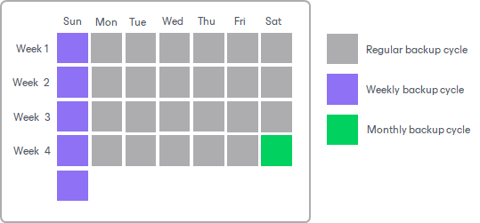

# Long-Term Retention (GFS) for Unstructured Data Backups

The long-term or Grandfather-Father-Son (GFS) retention policy allows you to store unstructured data backups for long periods of time — for weeks, months and years. For this purpose, Veeam Backup & Replication marks restore points with GFS flags. These GFS flags can be of three types: weekly, monthly or yearly. Depending on which flag is assigned to the restore point, it will be stored for specified number of weeks, months or years.

Unlike GFS restore points for machine backups, a GFS restore point for unstructured data is not a full backup. It is an aggregation of data across multiple restore points of the existing forever-forward-incremental chain. When you configure the GFS retention, on a regular incremental job run Veeam Backup & Replication marks the folders and data blobs with GFS flags. The marked aggregation of data blobs becomes the GFS restore point and is kept for a longer period, without creating an additional full backup. This makes long-term retention suitable for the large data sets typical of unstructured data workloads.

|  |
| --- |
| Note |
| Consider the following:   * The GFS retention is not supported for Microsoft Entra ID sources. * The GFS retention policy functions in combination with the short-term retention policy. Unlike the GFS retention for machine backups, the backup chain remains forever-forward incremental: Veeam Backup & Replication does not switch it to the forward incremental policy and does not create additional full backup files. * The GFS retention can not be applied to copied backups. * You can not copy a restore point that already has a GFS flag from a non-immutable repository to an immutable repository. |

GFS is a tiered retention policy and it uses a number of cycles to retain backups for different periods of time:

* Weekly backup cycle
* Monthly backup cycle
* Yearly backup cycle

In the GFS retention policy, weekly backups are known as ‘sons’, monthly backups are known as ‘fathers’ and yearly backups are known as ‘grandfathers’. Weekly, monthly and yearly backups are also called archive backups.

If you store unstructured data backups in an immutable backup repository, a GFS restore point remains immutable until the end of the longest applicable GFS retention period. For example, if you assign a two-year yearly GFS flag, the restore point stays immutable for two years. If you later extend a GFS retention period, Veeam Backup & Replication prolongs the immutability accordingly. If you shorten a GFS retention period, Veeam Backup & Replication removes the restore point once it exceeds the retention policy, or, for an immutable restore point, after its immutability period expires.

Related Topics

* [Data Structure in Backup, Archive and Secondary Repositories](unstructured_data_backup_structure.md)
* [Unstructured Data Backups in Immutable Repositories](unstructured_data_backup_in_immutable_repo.md)

Page updated 2026-08-05

