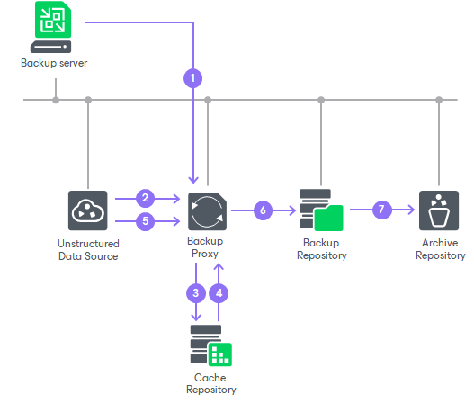

# How Unstructured Data Backup Works

In this article

Veeam Backup & Replication performs backup of unstructured data to the backup storage in the following way:

1. When a new backup job session starts, Veeam Backup & Replication assigns a backup proxy to process the unstructured data.
2. The backup proxy enumerates files and folders on the file share or object storage repository and creates a cyclic redundancy check (CRC) tree.
3. The backup proxy transfers the CRC tree to the cache repository.
4. The cache repository saves the CRC tree.

When the cache repository receives a new CRC tree structure from the proxy, it compares it with the CRC tree created during the previous run of the backup session. If any source files or folders have changed since the previous backup session run, the cache repository instructs the backup proxy to start reading changed data from the source file share or object storage repository.

1. The backup proxy reads new data from the source file share or object storage repository.
2. The backup proxy creates data packages and transfers them to the target backup repository.

Data packages comprise backup data files (each 64 MB in size) and metadata files that contain names and versions of backup files and allocation of data in backup files.

1. Veeam Backup & Replication checks file versions in the backup repository against retention settings and moves backup data from the backup repository to the archive repository if necessary.

In This Section

* [Data Structure in Backup, Archive and Secondary Repositories](unstructured_data_backup_structure.md)
* [Unstructured Data Backup Retention Scenarios](unstructured_data_backup_retention_scenarios.md)
* [Unstructured Data Backups in Object Storage Repositories](unstructured_data_backup_in_object_storage.md)
* [Unstructured Data Backups in Immutable Repositories](unstructured_data_backup_in_immutable_repo.md)
* [Unstructured Data Backups in Deduplicating Storage Appliances](unstructured_data_backup_dedup_storage_appliances.md)
* [Unstructured Data Backups in Scale-Out Repositories](unstructured_data_backup_in_sobr.md)
* [Scale-Out Repository with Extents in Metadata and Data Roles](unstructured_data_backup_sobr_extent_roles.md)
* [File Backup Integration with Storage Systems](storage_snapshot_integration.md)

Page updated 11/3/2025

Page content applies to build 13.0.1.1071
