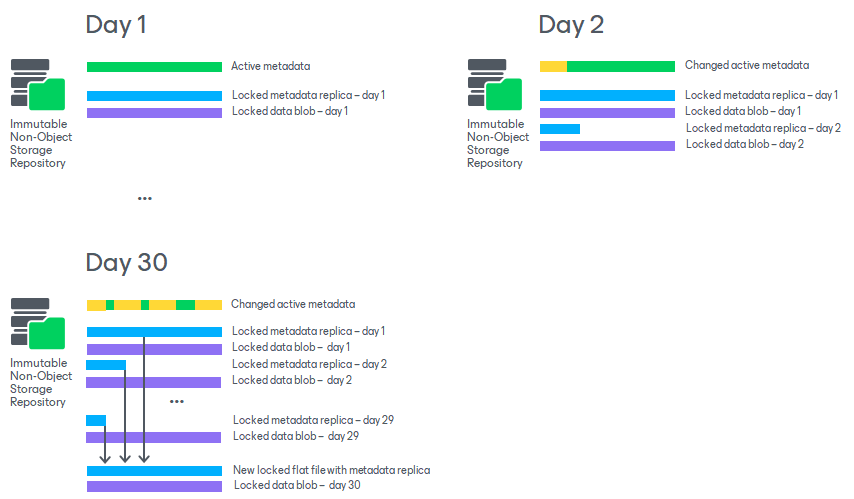
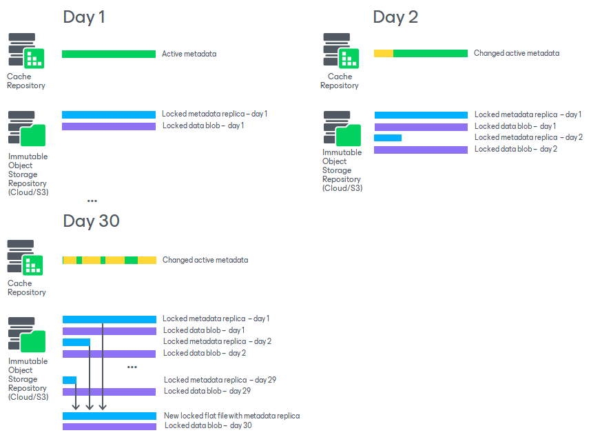

# Unstructured Data Backups in Immutable Repositories

All data stored in immutable repositories cannot be altered or removed until the immutability period expires and the immutability lock for the data is released. The only exception is active metadata for backups stored in immutable hardened repositories and immutable deduplicating storage appliances (HPE StoreOnce and Dell Data Domain).

For more information on the structure of unstructured backup data in backup repositories, see the [Data Structure in Backup, Archive and Secondary Repositories](unstructured_data_backup_structure.md) section.

How Immutability for Unstructured Backup Works

Immutability settings for a repository storing unstructured data backups apply to the entire backup of the unstructured data source. This includes all backup files protecting this source. The immutability countdown for the backup files begins when Veeam Backup & Replication marks some old file versions and their data blocks for deletion, as per the backup job retention settings. Files and data blocks are deleted from the backup repository when their immutability lock is released.

|  |
| --- |
| Note |
| If you use a backup repository with immutability enabled as an archive repository with the [Archive recent file versions](file_share_backup_job_archive_repo.md#archive) option (for a file backup job) or [Archive recent object versions](os_backup_job_archive_repository.md#archive) (for an object storage backup job), the immutability settings of the archive repository affect the retention behavior of the primary backup repository. For example, if the primary backup repository is a Windows host (that does not support immutability), and the archive repository is an S3 compatible object storage repository with 14 days of immutability, the backed-up data would be "logically" locked by the archive repository immutability for at least 14 days before retaining it. |

Unstructured Data Backups in Hardened Repositories and Immutable Deduplicating Storage Appliances

The immutability lock period for unstructured data backups in hardened repositories and deduplicating storage appliances (HPE StoreOnce and Dell Data Domain) is set by the backup repository immutability settings.

For an example of how this mechanism works, see Case 8 in the [Unstructured Data Backup Retention Scenarios](unstructured_data_backup_retention_scenarios.md#case_8) section. For more information on hardened repositories and on how to configure them, see the [Hardened Repository](hardened_repository.md) section. For more information on how to configure immutability for HPE StoreOnce, see the [HPE StoreOnce](deduplicating_appliance_storeonce.md#immutability) section, for Dell Data Domain — the [Dell Data Domain](dell_dd.md#immutability) section.

File Backups in Immutable Object Storage Repositories

For general information on immutability for object storage repositories in Veeam Backup & Replication and configuration details, see the [Immutability for Object Storage Repositories](immutability_object_storage_repositories.md) section.

In addition to the set immutability period for each object storage repository, Veeam Backup & Replication automatically adds up to 10 days to the immutability expiration date to reduce I/O operations and associated costs. This period is known as Block Generation. It is applied automatically and does not require configuration. For example, if the immutability period is 14 days, Veeam Backup & Replication automatically adds 10 days to specific objects to reduce I/O operations with the data blocks over time, totaling 24 days of immutability.

For an example of how this mechanism works, see Case 9 in the [Unstructured Data Backup Retention Scenarios](unstructured_data_backup_retention_scenarios.md#case_9) section. For more information, see the [Block Generation](object_storage_block_generation.md) section for object storage repositories.

|  |
| --- |
| Important |
| We strongly recommend the following configuration for storing unstructured data backups in immutable object storage repositories:   * Set the immutability period for the immutable object storage repository to a maximum of 14 days. * Configure file backup jobs or object storage backup jobs that use the immutable object storage repository to run no more than once per day.   Otherwise, the unstructured data backup may consume excessive storage space.  These settings are crucial for cloud object storage repositories where storage costs can be significant. |

Metadata of Unstructured Data Backups in Immutable Storage Repositories

When creating unstructured data backups, Veeam Backup & Replication generates two sets of metadata: active metadata and metadata replica. The metadata replica is always stored in the backup repository alongside the data. The active metadata storage location varies depending on the backup repository type:

* In hardened repositories or deduplicating storage appliance (HPE StoreOnce or Dell Data Domain), the active metadata is stored in the immutable repository with the locked metadata replica and locked backup data.
* In object storage repositories, the active metadata is stored in the cache repository.

Data in immutable repositories is locked temporarily and cannot be modified or removed until the immutability period ends. The metadata replica that is stored next to the data is also immutable and unchangeable. However, the active metadata does not have the immutability lock, changes actively during every backup session and keeps the up-to-date state of the unstructured data backup. Thus, it can be used by Veeam Backup & Replication to track changes in the unstructured data backup.

Once in 30 days (if the job runs once a day or once in several days) or as the metadata replica chain reaches 30 generations (if the job runs several times a day), Veeam Backup & Replication uses metadata replica files created during this period to generate a new locked metadata flat file.

After the immutability period for the metadata replica files, which were already transformed into the metadata flat file, ends, Veeam Backup & Replication removes them from the object storage repository.

The schemas in this section show examples of creating a locked metadata flat file for a job that runs once every day. After 30 generations of metadata replica files are created (that is after 30 days), Veeam Backup & Replication uses them to generate a new metadata flat file. The older metadata replica files that comprised it are marked for deletion and can be deleted based on the retention and immutability settings of the repository.

Metadata in Hardened Repositories and Immutable Deduplicating Storage Appliances

If unstructured data backups are stored in an immutable hardened repository or deduplicating storage appliance (HPE StoreOnce or Dell Data Domain), the active metadata is stored on the immutable repository alongside with the locked metadata replica and locked backup data.

Metadata in Immutable Object Storage Repositories

If unstructured data backups are stored in an immutable object storage such as Amazon S3, Microsoft Azure Storage, IBM Cloud Object Storage, Wasabi Cloud Object Storage, or S3-compatible object storage, the active metadata is stored on the cache repository.

