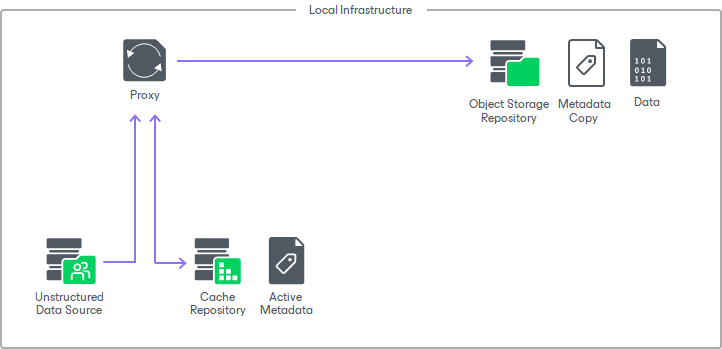
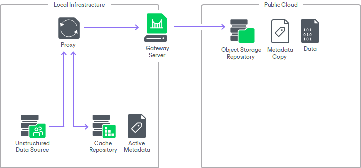
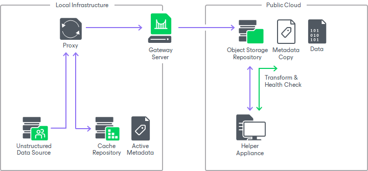
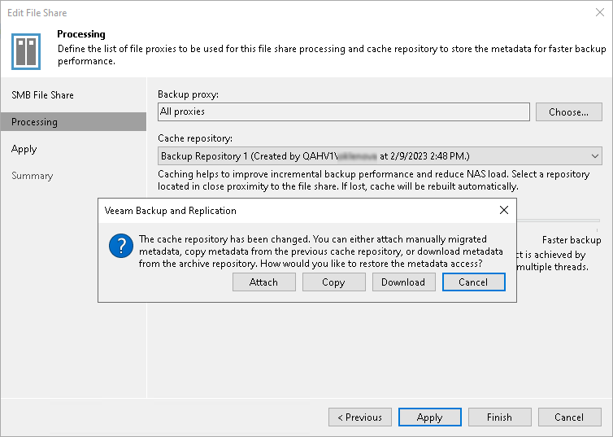

# Unstructured Data Backups in Object Storage Repositories

In this article

How Unstructured Data Backup to Object Storage Repository Works

You can select an object storage repository added in your backup infrastructure as a backup repository for storing unstructured data backups.

For unstructured data backups stored on non-object storage repositories, Veeam Backup & Replication stores active metadata, metadata copy, and the data itself all next to each other on the repository, as described in the [Data Structure in Backup, Archive and Secondary Repositories](unstructured_data_backup_structure.md) section.

The main peculiarity of storing unstructured data backups in an object storage repository is keeping active metadata in the cache repository. This metadata is actively used during backup, restore, merge, transform, or health check operations. All the changes of the active metadata is then replicated to the metadata replica that is stored on the repository next to the data.

The metadata replica is self-sufficient: if anything happens to the source unstructured data and the cache repository, you still will be able to restore data from the backup stored in the object storage repository.

Types of Connection to Object Storage Repository

Depending on your infrastructure and the activity type, the source general-purpose backup proxy can connect to the object repository through one of the connection types:

* Direct. In this mode, the general-purpose backup proxy writes directly to the object storage. This connection type is used, for example, for backup and restore sessions when your target object storage repository is located in your local infrastructure.

* Through gateway servers. In this mode, the backup server automatically selects the most suitable gateway server from the preconfigured list. This connection type is used, for example, for backup copy sessions when the source backup is stored on an SMB or NFS share, or if the target object storage repository is a cloud repository.

The connection type is configured at the Account step of the [New Object Storage Repository](new_object_storage.md) wizard.

Helper Appliance in Unstructured Data Backup

Unstructured data is forever forward incremental and it does not create periodic full backups. To avoid constantly downloading data to and uploading data from the cloud object storage for performing transform and health check operations, you can configure a helper appliance. To learn how to configure the helper appliance, see the Mount Server step in [Adding S3 Compatible Object Storage](compatible_mount_server.md), [Adding Amazon S3 Storage](amazon_storage_mount_server.md), [Adding Google Cloud Object Storage](google_cloud_storage_mount_server.md), [Adding IBM Cloud Object Storage](ibm_storage_mount_server.md), [Adding Azure Blob Storage](azure_storage_mount_server.md), [Adding Wasabi Cloud Object Storage](wasabi_mount_server.md).

Changing Cache Repository

If your unstructured data source is protected with an unstructured data backup job that backs up data to an object storage and you decide to change the cache repository for this data source, Veeam Backup & Replication will prompt you to:

* Attach manually migrated data. You can manually copy metadata from the old cache repository to a new one. After that, when changing the cache repository for the unstructured data source, click Attach in the displayed window.
* Copy metadata from the previous cache repository. If you click Copy when changing the cache repository for the unstructured data source, Veeam Backup & Replication will automatically copy all metadata from the old cache repository to a new one.
* Download metadata from the archive repository. If the old cache repository is not available, you can click Download when changing the cache repository for the unstructured data source to automatically download all metadata to a new cache repository.

Page updated 11/10/2025

Page content applies to build 13.0.1.1071
