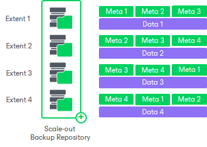

# Unstructured Data Backups in Scale-Out Repositories

If you use a scale-out backup repository as a backup repository for storing unstructured data backups, by default Veeam Backup & Replication evenly distributes backup data among all the performance extents added to this repository. The backup data is accompanied by the metadata files. To provide an opportunity to restore data written to extents remaining available in case one or two of other extents are unavailable, Veeam Backup & Replication triplicates metadata when writing it to extents. Thus, every extent keeps metadata for data stored on this extent (in folder meta) and replica of metadata for data stored on adjacent extents (in folder metabackup). Even if two of three adjacent extents are lost, you can restore backup data stored on the third extent.

|  |
| --- |
| Note |
| Consider the following when storing unstructured data backups on a scale-out backup repository:   * The metadata redundancy approach protects against two extents out of three being completely lost. * The metadata redundancy approach allows protecting metadata, not data. * An unstructured data backup job consumes 1 task slot on every extent of the SOBR per each file share added to the job. * The backup file placement policy set for the scale-out backup repository, as described in section [Backup File Placement for Performance Tier](backup_repository_sobr_placement.md), is ignored. |

