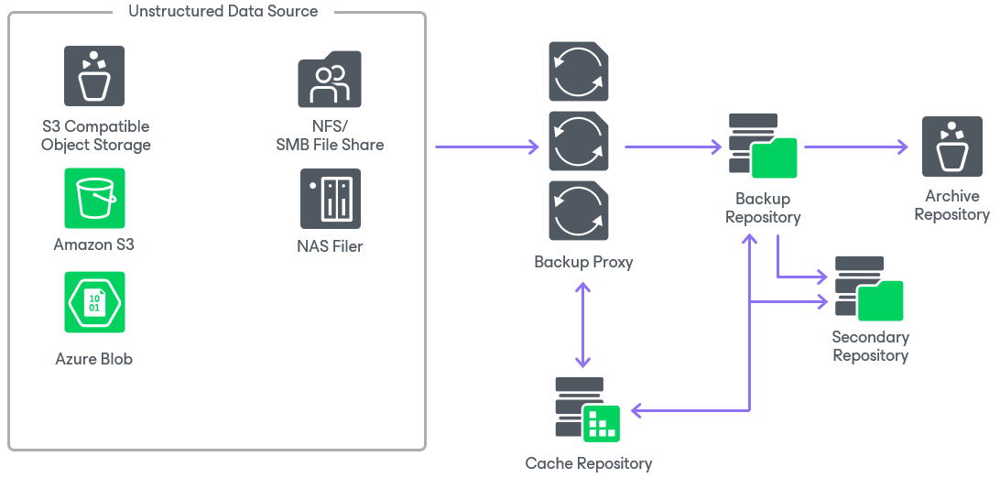
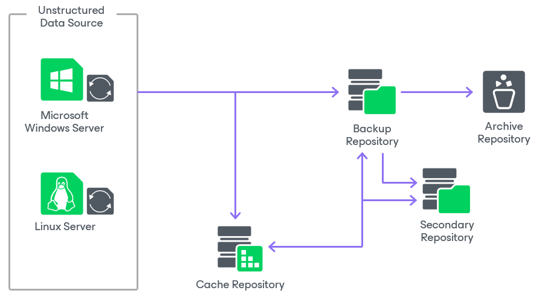

# Backup Infrastructure for Unstructured Data Backup

To protect your unstructured data, you can use your existing Veeam Backup & Replication infrastructure. To do so, configure the following components:

* [Unstructured Data Source](#unstructured_data_source):

* [File shares](#file_share)
* [Object storage](#object_storage)

* [General-purpose backup proxies](#file_proxy)
* [Cache repository](#cache_repository)
* [Storage repositories](#backup_repository)

For system requirements for unstructured data backup components, see the [System Requirements](system_requirements_unstructured_data.md) section.

|  |
| --- |
| Note |
| Backup of the content of file shares and object storage repositories is not supported by Veeam Cloud Connect. |

To learn how backup components interact during the unstructured data backup, see the [How Unstructured Data Backup Works](unstructured_data_backup_hiw.md) section.

Unstructured Data Source

Unstructured data supported as a source for backup by Veeam Backup & Replication includes:

* [File shares](#file_share)
* [Object storage](#object_storage)

File Shares

A file share is a storage device or data source available to multiple hosts through a computer network.

For supported file shares, requirements and limitations, see [Supported Platforms, Applications and Workloads](platform_support.md#file_servers).

File backup jobs in Veeam Backup & Replication can read data from the following sources:

* SMB (CIFS) path
* NFS path
* Path to the storage snapshot folder
* VSS snapshot

|  |
| --- |
| Note |
| Consider the following limitations:   * Reading from VSS snapshots on SMB shares is available only under certain conditions, listed in [this Veeam KB article](https://www.veeam.com/kb3099). * Reading from VSS snapshots on DFS shares is not supported. * Names of NTFS Alternate Data Streams (ADS) may be unencrypted if both the file being backed up and its ADS are empty. * Different encoding systems for file paths within one file share are not supported. If the file or directory names in your environment have special symbols and use encoding other than en-us.UTF-8, you need to manually specify the encoding of each file share. For more information, see [this Veeam KB article](https://www.veeam.com/kb4645). |

To learn how to add file shares to the inventory of the virtual infrastructure, see the [Adding Unstructured Data Source](adding_unstructured_data_source.md) section.

Object Storage

An object storage is storage based on either a cloud solution or an S3 compatible on-premises storage solution.

For supported object storage, requirements and limitations, see [Supported Platforms, Applications and Workloads](platform_support.md#os).

To learn how to add object storage as a source for backup to the inventory of the virtual infrastructure, see the [Adding Object Storage](adding_object_storage.md) section.

General-Purpose Backup Proxies

A general-purpose backup proxy is an architecture component that sits between the unstructured data source and other components of the backup infrastructure. In case of Microsoft Windows and Linux servers, the role of the general-purpose backup proxy is assigned to these servers instead of a dedicated one. The backup proxy operates as a data mover that transfers data between the data source and the backup repository. The backup proxy processes jobs and delivers backup and restore traffic.

For more information on general-purpose backup proxies, their requirements, limitations and deployment, see the [General-Purpose Backup Proxies](backup_proxy_general.md) section.

After you configure the backup proxy, choose it to process the backup traffic from unstructured data sources, as described in the [Adding NFS File Share](file_share_backup_nfs_share_processing_settings.md), [Adding SMB File Share](file_share_backup_smb_share_processing_settings.md), [Adding S3 Compatible Object Storage](os_s3_compatible_processing.md), [Adding Amazon S3 Object Storage](os_s3_aws_processing.md), and [Adding Microsoft Azure Blob Storage](os_azure_processing.md) sections.

Cache Repository

A cache repository is a storage location where Veeam Backup & Replication keeps temporary metadata and uses it to reduce the load on the data source during the backup procedure. The cache repository keeps track of all objects that have changed between each backup session. This allows performing incremental backups from the unstructured data source fast and efficiently. If you store your unstructured data backups on an object storage repository, the cache repository also stores active metadata. For more information, see the [Data Structure in Backup, Archive and Secondary Repositories](unstructured_data_backup_structure.md) and [Unstructured Data Backups in Object Storage Repositories](unstructured_data_backup_in_object_storage.md) sections.

You can assign the role of a cache repository to a backup repository added to the Veeam Backup & Replication infrastructure. To assign this role, select the backup repository as a cache repository when [adding an unstructured data source](adding_unstructured_data_source.md).

|  |
| --- |
| Note |
| You can not assign the role of a cache repository to deduplicating storage appliances. |

To minimize the network load during backup, locate the cache repository closer to the backup proxy in the computer network: at the best, they should be located on one machine.

Storage Repositories

A backup repository is a main storage location where Veeam Backup & Replication keeps all versions of backed up files for the configured period and metadata files. Backups stored in the backup repository can be used to quickly restore the entire file share to the state as of a specific restore point.

[Optional] If you want to retain specific files for a longer period of time, you can use cheaper devices for archive purposes. To enable file archiving, configure Veeam Backup & Replication to move backup files and metadata files from the backup repository to an archive repository. By default, usage of the archive repository is disabled and, after the retention period for the backup repository is over, backup files are deleted.

[Optional] If you want to store a copy of the unstructured data backup in a different repository, you can configure a secondary repository where Veeam Backup & Replication will copy all backups created in the backup repository. The secondary repository can have its own retention policy and encryption settings. By default, no secondary repository is configured.

The following table describes which roles can be assigned to different storage types.

| Storage Type | Backup Repository | Archive Repository | Secondary Repository |
| --- | --- | --- | --- |
| [Microsoft Windows server](ms_server.md) | ✓ | ✓ | ✓ |
| [Linux server](linux_server.md) | ✓ | ✓ | ✓ |
| [Hardened linux server](hardened_repository.md) | ✓ | ✓ | ✓ |
| [SMB (CIFS) share](smb_share.md) 1 | ✓ | ✓ | ✓ |
| [NFS share](nfs_share.md) | ✓ | ✓ | ✓ |
| [Dell Data Domain with Data Domain Boost (DDBoost) license](dell_dd.md) | ✓ | ✓ | ✓ |
| [ExaGrid](deduplicating_appliance_exgrid.md) | ✓ | ✓ | ✓ |
| [HPE StoreOnce with Catalyst license](deduplicating_appliance_storeonce.md) 2 | ✓ | ✓ | ✓ |
| [Quantum DXi](deduplicating_appliance_quantum.md) | ✓ | ✓ | ✓ |
| [Fujitsu ETERNUS CS800](fujitsu.md) | ✓ | ✓ | ✓ |
| [Infinidat InfiniGuard](infinidat_infiniguard.md) | ✓ | ✓ | ✓ |
| [Scale-out backup repository (SOBR)](backup_repository_sobr.md) 3, 4 | ✓ | ✕ | ✓ |
| [Object storage repository](object_storage_repository.md) 5 | ✓ | ✓ | ✓ |
| [Repository with rotated drives](backup_repository_rotated.md) | ✓ | ✕ | ✓ |
| [Veeam Cloud Connect repository](veeam_cloud_connect.md) | ✕ | ✕ | ✕ |

1 If you use a Dell PowerScale (formerly Isilon) storage system in the CIFS Share Access mode, make sure that you have assigned your service account to the built-in BackupAdmin role within PowerScale. Otherwise, the access to the share will be denied.

2 If you plan to use HPE StoreOnce storage appliances, consider the following recommendations for optimal performance:

* A StoreOnce system can have multiple Catalyst stores, and large backup loads (exceeding 1PB) should be spread across more than one Catalyst store on the same StoreOnce system.
* Do not include Catalyst stores in a SOBR intended for unstructured data backups. This will reduce the global deduplication of the StoreOnce system.

3 An object storage repository added as a [capacity tier](new_capacity_tier.md) in a scale-out backup repository cannot be used for storing unstructured data backups. To archive unstructured data backup files to an object storage repository, assign the object storage repository as an archive repository when [you create a file backup job](file_share_backup_job_storage.md).

4 SOBR consisting of object storage repositories cannot be used as a target backup repository for file backup jobs.

5 Consider the following limitations:

* Amazon S3 Glacier and Azure Blob Storage Archive Tier are not supported for unstructured data backup.
* Amazon S3 Snowball Edge and Azure Databox are not supported as archive repositories for unstructured data backup, but you can use them as backup repositories, secondary repositories, or targets for [copying file share backups](unstructured_data_backup_copy_backups.md).
* You cannot use S3 compatible repositories with multiple buckets as a target repository for Unstructured Data. This includes backup, archive, or secondary repositories.

You can create two object storage repositories pointing to the same cloud folder/bucket and use these repositories for storing both unstructured data backups and [Capacity Tier](capacity_tier.md) backups at the same time: one object storage repository will be used to store unstructured data backups, the other one – to store virtual and physical machine backups as a capacity tier in a single SOBR. However, these object storage repositories (mapped to the same cloud folder) must not be used across multiple Veeam Backup & Replication servers for the same purposes as it leads to unpredictable system behavior and inevitable data loss.

Deployment of Backup, Archive and Secondary Repositories

To use a storage, which is already added to the Veeam Backup & Replication Backup Infrastructure, to store unstructured data backups, define it as a target storage when creating a file backup job or an object storage backup job:

* Configure the backup repository at the Backup Repository step of the wizard when creating [file backup jobs](file_share_backup_job_storage.md) and [object storage backup jobs](os_backup_job_target_repository.md).
* Configure the backup repository at the Archive Repository step of the wizard when creating [file backup jobs](file_share_backup_job_archive_repo.md) and [object storage backup jobs](os_backup_job_archive_repository.md).
* Configure the backup repository at the Secondary Target step of the wizard when creating [file backup jobs](file_share_backup_job_secondary_target.md) and [object storage backup jobs](os_backup_job_secondary_repository.md).

If the required storage is not added as a backup repository in your Veeam Backup & Replication Backup Infrastructure, add it as described in the [Backup Repositories](backup_repository.md) section.

In This Section

* [Adding Unstructured Data Source](adding_unstructured_data_source.md)

