# Unstructured Data Backup Retention Scenarios

There can be a number of backup retention scenarios depending on the configuration of backup and archive repositories. In this section, you can find example cases that illustrate file and object storage backup retention with different settings.

Case 1

Only 1 file version is created. The file does not change.

File version 1 always remains in the backup repository and is not moved to the archive repository even if this behavior is enabled and configured in the retention policy settings.

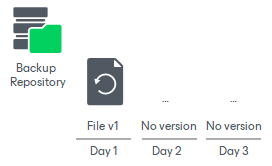

Case 2

Retention for the backup repository is set to 5 days. No archive repository is configured. The file changes once a day. The backup is performed once a day.

On day 6, file version 6 is added to the backup repository, file version 1 is deleted by retention.

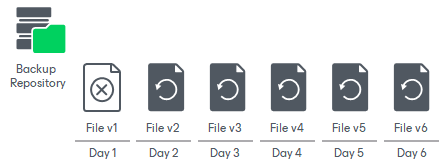

Case 3

Retention for the backup repository is set to 3 days. The file changes every hour. The backup is performed 2 times a day.

On day 4, versions 7 and 8 are added to the backup repository, file versions 1 and 2 added to the backup repository on day 1 are deleted by retention.

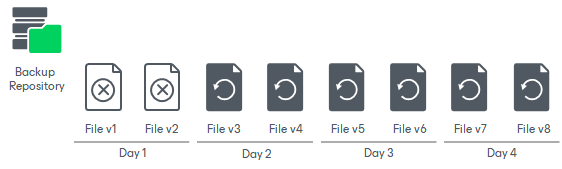

Case 4

Retention for the backup repository is set to 3 days. The file changes once a day.

On day 3, the source file is deleted from the source share, the backup repository considers file version created on this day as deleted.

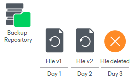

On day 4, the backup repository still detects the file as deleted, file version 1 is deleted from the backup repository by retention.

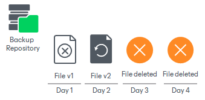

On day 5, the backup repository still detects the file as deleted, file version 2 is deleted from the backup repository by retention.

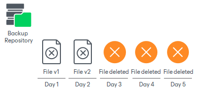

Thus, no file versions are stored in the backup repository for this file any longer.

Case 5

Retention for the backup repository is set to 5 days. The archive repository is enabled with default settings. The file changes every day. The backup is performed once a day.

On day 6, file version 6 is added to the backup repository, file version 1 is moved to the archive repository by retention.

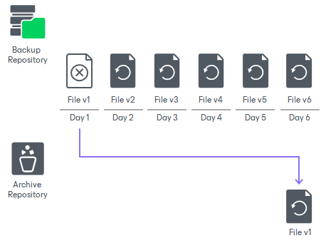

Case 6

Retention for the backup repository is set to 3 days. The archive repository is enabled with DOCX files to be excluded from archiving. The files change once a day. The backup is performed once a day.

On day 4, file versions created on day 1 are removed from the backup repository. File version 1 for DOCX file is deleted, file version 1 for XLSX file (non-DOCX) is moved to the archive repository.

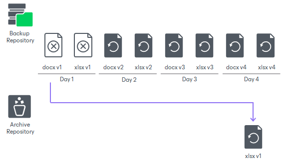

Case 7

Retention for the backup repository is set to 4 days. The archive repository is enabled and configured to keep 3 versions of active files and 2 versions of deleted files.

On day 8, file version 8 is added to the backup repository, file version 4 is moved from the backup repository to the archive repository to keep file versions for 4 days, file version 1 is deleted from the archive repository to keep 3 file versions of the active file (versions 2, 3, 4).

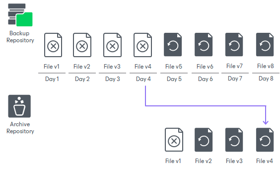

On day 9, the file is removed from the source, file version 9 (denoting the missing file) is added to the backup repository, file version 5 is moved from the backup repository to the archive repository, file versions 2 and 3 are deleted from the archive repository to keep 2 file versions of the deleted file (versions 4 and 5).

On day 10 and 11, file versions 6 and 7 are successively moved from the backup repository to the archive repository. File versions 4 and 5 are deleted from the archive repository.

On day 12, file version 8 (the last file version) is moved from the backup repository to the archive repository, file version 6 is deleted from the archive repository. After that, versions 7 and 8 are stored in the archive repository further on.

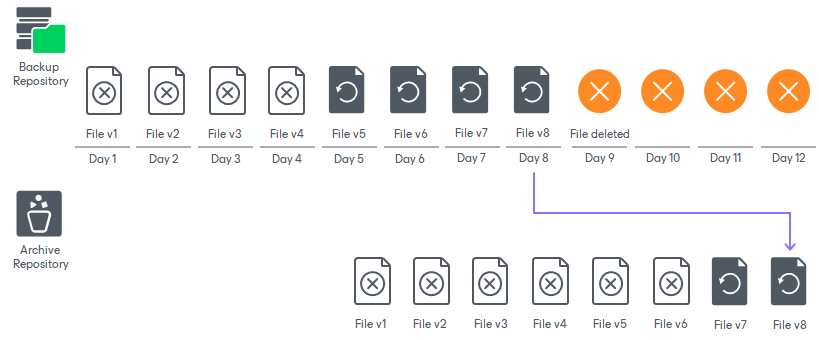

Case 8

Retention for the backup repository which is a hardened repository is set to 30 days, the immutability for it is set to 14 days. The file changes once a day.

On day 3, the source file is deleted from the source share, the backup repository considers the file version created on this day as deleted.

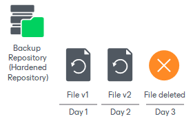

According to retention settings, Veeam Backup & Replication will keep all file versions for 30 days. After that, it will start marking them for deletion. On day 31, file version 1 is marked for deletion from the backup repository by retention, but as the repository is immutable it will still keep this file version.

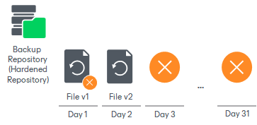

On day 32, file version 2 is marked for deletion from the backup repository by retention, but as the repository is immutable it will keep this file version as well.

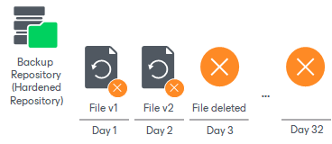

On day 45, when the immutability lock is released after 14 days (14 days of immutability configured for the repository), file version 1 is deleted from the backup repository. File version 2 is marked for deletion, but is still immutable.

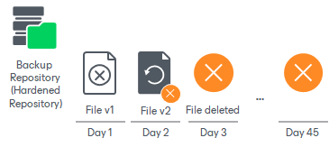

Finally, on day 46, the immutability lock is released for file version 2 and it is deleted from the backup repository.

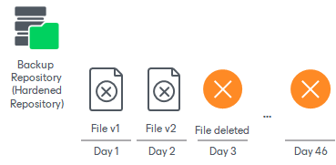

Thus, no file versions are stored in the backup repository for this file any longer.

Case 9

Retention for the backup repository which is an immutable object storage is set to 30 days, the immutability for it is set to 14 days, 10 days of immutability are added automatically as a Block Generation period described in the [File Backups in Immutable Repositories](unstructured_data_backup_in_immutable_repo.md) section. The file changes once a day.

On day 3, the source file is deleted from the source share, the backup repository considers file version created on this day as deleted.

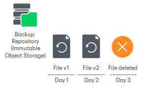

According to retention settings, Veeam Backup & Replication will keep all file versions for 30 days. After that, it will start marking them for deletion. On day 31, file version 1 is marked for deletion from the backup repository by retention, but as the repository is immutable it will still keep this file version.

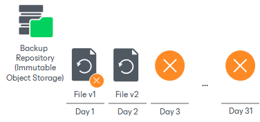

On day 32, file version 2 is marked for deletion from the backup repository by retention, but as the repository is immutable it will keep this file version as well.

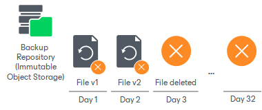

On day 55, when the immutability lock is released after 24 days (14 days of the immutability period configured for the repository plus 10 days of the Block Generation period), file version 1 is deleted from the backup repository. File version 2 is marked for deletion, but is still immutable.

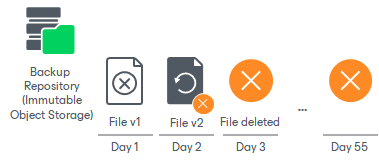

Finally, on day 56, the immutability lock is released for file version 2 and it is deleted from the backup repository.

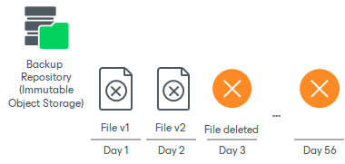

Thus, no file versions are stored in the backup repository for this file any longer.

