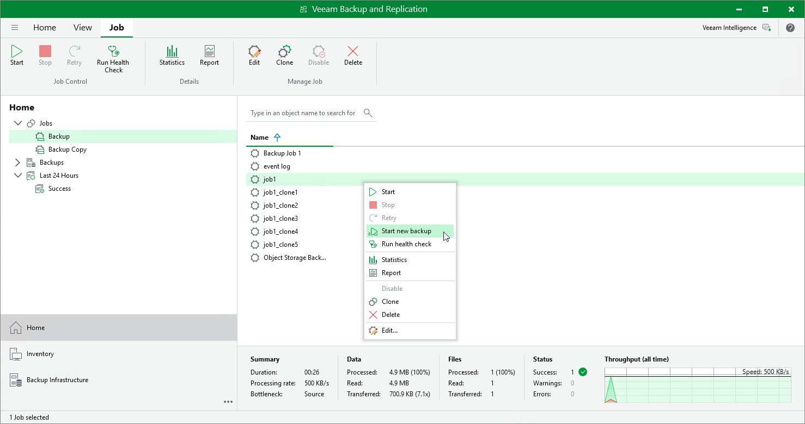

# Starting New Backup Chain

In this article

You can start a new backup chain for the unstructured data backup job. Veeam Backup & Replication then creates a new active full backup that starts the new chain for the entire protected file share or bucket. All existing backup files are moved to the Disk (Orphaned) node under the Backups node in the Veeam Backup & Replication Console. Data files are stored to the same folder in the backup repository. The data files for the new backup chain are stored to a new separate folder in the backup repository.

To start a new backup chain:

1. Open the Home view.
2. In the inventory pane, select Jobs > Backup.
3. In the working area, select a job of the File Backup or Object Storage Backup type, press and hold the [Ctrl] key, right-click the job and select Start new backup.

Page updated 9/8/2025

Page content applies to build 13.0.1.1071
