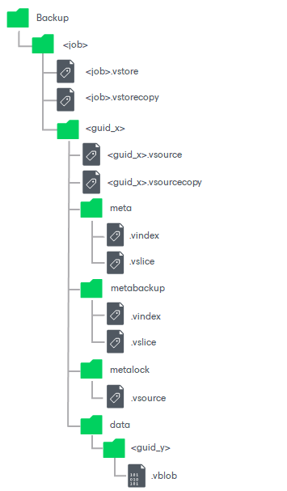

# Data Structure in Backup, Archive and Secondary Repositories

In this article

Backup, archive and secondary repositories store file and object storage backups as objects in VBLOB files (up to 64 MB each) of unstructured data. They also store metadata about the original objects on unstructured data sources and their structure.

When you run the file backup job or object storage backup for the first time, Veeam Backup & Replication creates a full backup for objects on the data source. During subsequent backup job sessions, Veeam Backup & Replication copies only objects that have changed since the last backup job session.

Although the file backup job or object storage backup job first creates a full backup and afterwards incremental backups, Veeam Backup & Replication does not create a separate file for each backup job run as it does during VM backup. Instead of this, it consistently creates multiple VBLOB files accompanied by metadata files that track all the changes on the unstructured data source.

In course of time, as the retention is applied to data blocks in VBLOB files, some blocks are marked as outdated and due for deletion. When the number of outdated blocks in a VBLOB file reaches a certain, so called transformation threshold, Veeam Backup & Replication reorganizes the data in the VBLOB file. The transformation threshold value is different for each object storage type and for each role that the object storage is used in (backup repository or archive repository). By default the threshold is set to the optimum percentage of changed blocks. You can learn the default threshold value for the object storage used as a backup repository from Veeam Backup & Replication logs, from [Veeam Customer Support](https://www.veeam.com/support.html) or by running the [Get-VBRNASObjectStorageTransformThreshold](https://helpcenter.veeam.com/docs/vbr/powershell/get-vbrnasobjectstoragetransformthreshold.html?ver=13) PS cmdlet. If required, you can update the transformation threshold value for the object storage used as a backup repository by using the [Set-VBRNASObjectStorageTransformThreshold](https://helpcenter.veeam.com/docs/vbr/powershell/set-vbrnasobjectstoragetransformthreshold.html?ver=13) PS cmdlet. Do that with maximum caution.

Veeam Backup & Replication uses the following structure for storing the file backup data and object storage backup data in the backup repository:

| Folder/File | | | | | | Description |
| --- | --- | --- | --- | --- | --- | --- |
| Backup |  |  |  |  |  | Folder in the repository that is dedicated to store backups. |
|  | <job> |  |  |  |  | Folder that contains all data backed up by a specific file backup job or object storage backup job. Data for each job will be placed to its own directory. |
|  |  | <job>.vstore |  |  |  | XML metadata file that describes the entire backup file for a specific file backup job or object storage backup job. |
|  |  | <job>.vstorecopy |  |  |  | Copy of the XML metadata file that describes the entire backup file for a specific file backup job or object storage backup job. |
|  |  | <guid\_x> |  |  |  | Folder that contains all data for a single source. Data for each source will be placed to its own directory. |
|  |  |  | <guid\_x>.vsource |  |  | XML metadata file that describes the single source object. |
|  |  |  | <guid\_x>.vsourcecopy |  |  | Copy of the XML metadata file that describes the single source object. |
|  |  |  | meta |  |  | Folder with binary metadata files that describe the content of the backup.  If backup files are stored on an object storage repository, this folder is missing from the repository itself and is instead stored on the cache repository specified for the selected backup repository.  If backup files are stored on a scale-out backup repository, this folder on each performance extent contains metadata for data stored on the same extent of the scale-out backup repository. For more information, see [Unstructured Data Backups in Scale-Out Repositories](unstructured_data_backup_in_sobr.md).  If the repository where you store backups is immutable, this folder and files in it do not have the immutability lock and may be updated at every backup job run. |
|  |  |  |  | .vindex |  | Binary metadata that describes backup files (names and versions). |
|  |  |  |  | .vslice |  | Binary metadata that describes allocation of data in VBLOB backup files. |
|  |  |  | metabackup |  |  | Folder with a replica of binary metadata files.  If backup files are stored on a scale-out backup repository, this folder on each performance extent contains replica of metadata stored on other extents of the scale-out backup repository. For more information, see [Unstructured Data Backups in Scale-Out Repositories](unstructured_data_backup_in_sobr.md).  If backup files are stored on an object storage repository, this folder is replaced with the folder named metacopyv2. |
|  |  |  | metalock |  |  | Folder with XML data files that describe immutable metadata replica.  This folder exists only for backups in immutable repositories. |
|  |  |  |  | .vsource |  | XML metadata file that describes a single immutable metadata replica. |
|  |  |  | data |  |  | Folder with binary data. |
|  |  |  |  | <guid\_y> |  | 1 GB basket that stores VBLOB backup files. |
|  |  |  |  |  | .vblob | By default, a classic 64 MB file that stores data from the file share backup or object storage backup.  If necessary, you can convert unstructured data backup files into the single file basket format recommended for storing data on HPE StoreOnce storage appliances. For more information, see description of the Convert-VBRNASBackupStorageFormat cmdlet in the [Veeam PowerShell Reference](https://helpcenter.veeam.com/docs/vbr/powershell/convert-vbrnasbackupstorageformat.html?ver=13). |

Page updated 9/17/2025

Page content applies to build 13.0.1.1071
