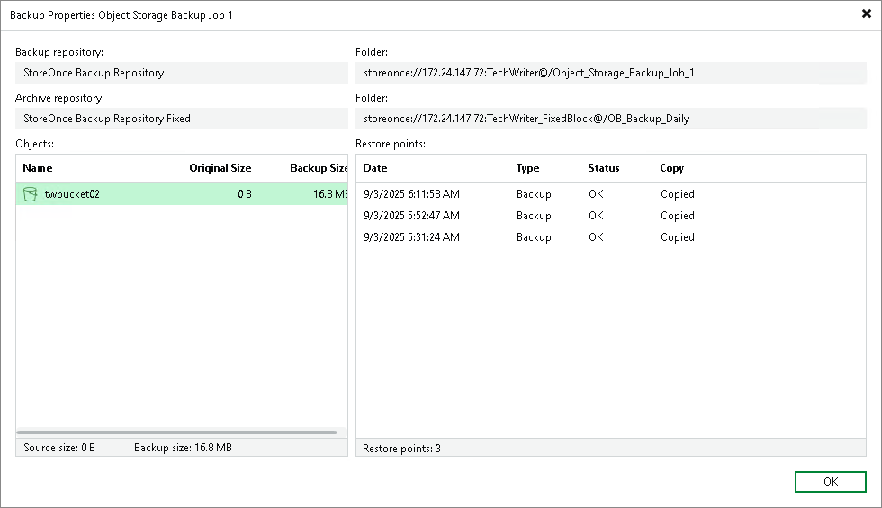

# Viewing Unstructured Data Backup Properties

In this article

You can view summary information about the unstructured data backup. The summary information provides the following data:

* Name and path to the backup repository that stores backup files.
* Name and path to the archive repository that stores archived backup data.
* Path to the backup source and its original size.
* Available restore points: date of their creation, their type (Backup or Archive) and status.

For the Backup type, the table shows all restore points stored in the backup repository. You can restore the unstructured data to the state as of any of these points. To learn how to restore the file share data, see [File Share Data Recovery](file_share_data_recovery.md), to restore object storage data — [Object Storage Data Recovery](os_data_recovery.md).

For the Archive type, the table shows only a single record. The time stamp of this record denotes the date and time of the restore point, which was created in the backup repository and files of which were the first to be moved to the archive repository according to retention settings. To learn how to restore files from the archive, see the Restoring Backup Files from Archive Repository sections for the [file share data recovery](restore_files_from_archive.md) and the [object storage data recovery](os_data_recovery_restore_files_from_archive.md).

To view summary information for backups:

1. Open the Home view.
2. In the inventory pane, select Backups.
3. In the working area, right-click the backup and select Properties.
4. To see the list of available restore points, select the required object from the Objects list.

Page updated 9/8/2025

Page content applies to build 13.0.1.1071
